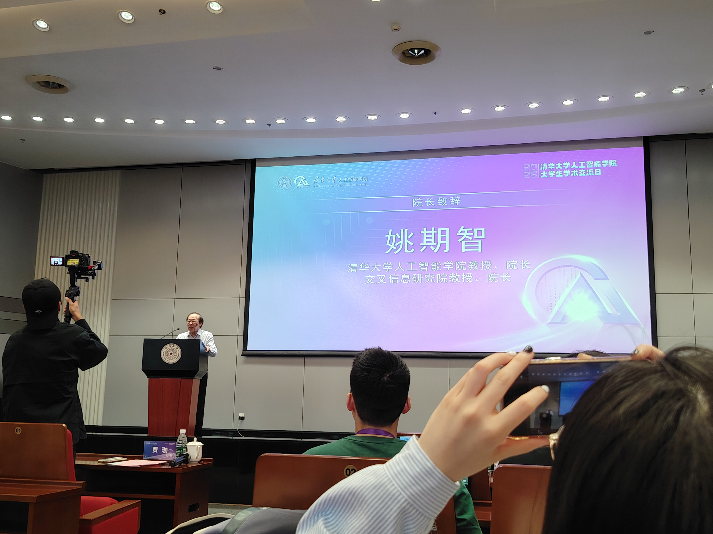
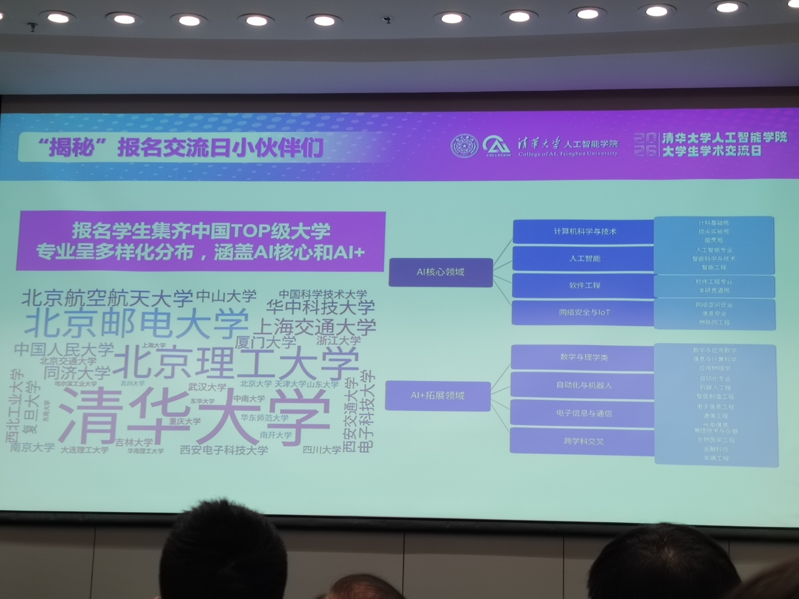
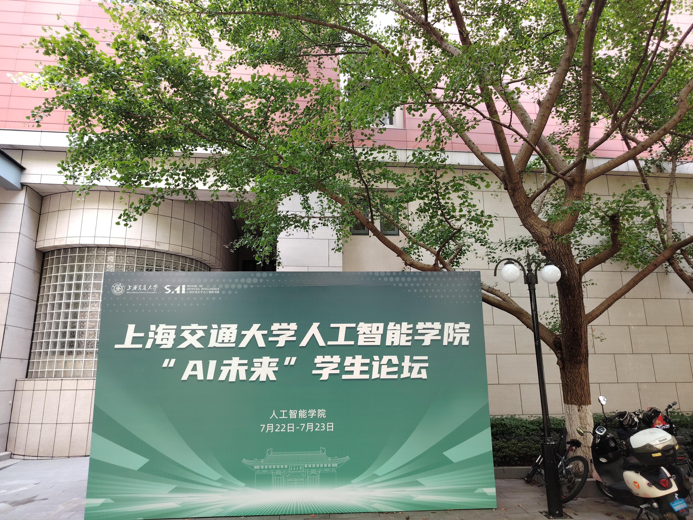
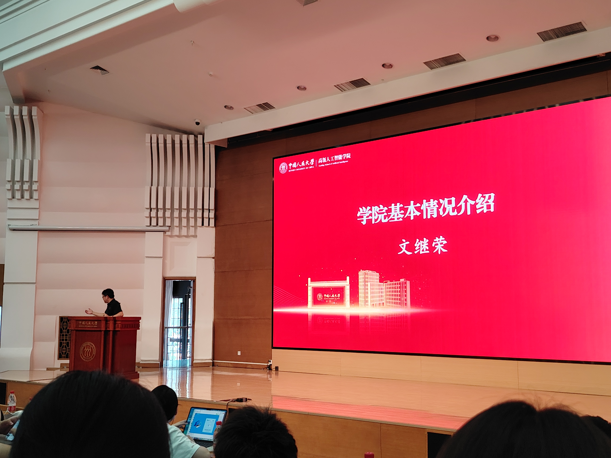
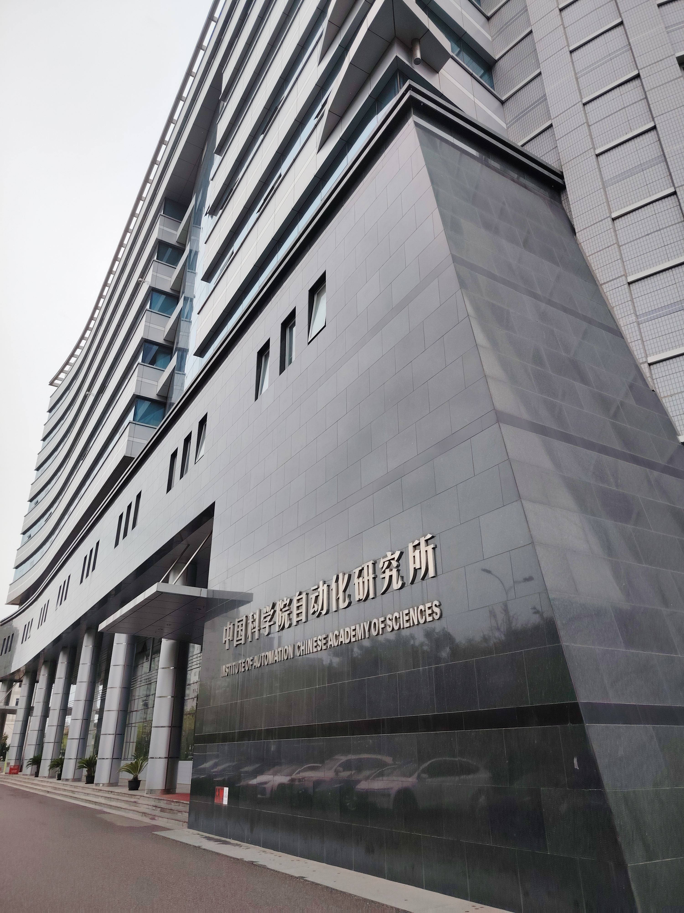
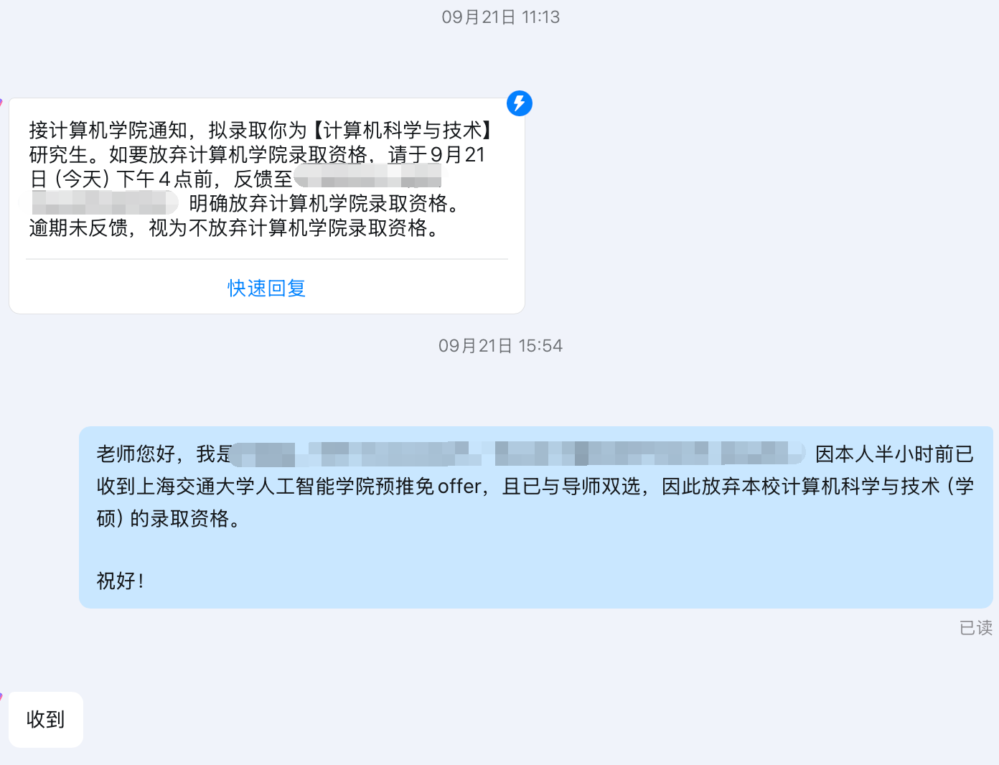

图文无关。画师为 X(twitter) 上的 @risuyorokobi 。

## 前言

每个人情况终究不同，本帖也只是以个人视角做出介绍。本人报的院校较少，最后还是有幸获得了一个联培的名额，并且该offer很铁。我也没有鸽过任何老师。

## 个人情况

- **学校**：中九
- **专业**：计算机拔尖班
- **rank**：前五学期rank1，可以开大类是130+的排名；前六学期rank2，可以开大类是80+的排名。指的都是绩点，没用过综测排名
- **竞赛**：无
- **科研**：夏令营期间一篇n作在投，9月中了CoRL
- **英语**：六级550+，四级600+
- **荣誉**：两次国家奖学金

个人意向：导师 ≈ 研究方向（具身）> 学校title ≈ 城市

最终去向：上交与上海期智研究院联培，导师为清华叉院。

## 保研黑话

- **rank（rk）**：指学生的绩点/综测排名，部分院校筛简历时会卡rank，也就是低于某个排名百分比不让进。
- **bar**：指院校夏令营或预推免的入营门槛。一般学校越好，bar越高。
- **wl**：即waiting list，候补队列。如果前面有人放弃资格，候补者就有机会依次递补。
- **oq**：即over qualified，指学生水平远超所报院校的生源水平，院校因担心其最终不会选择自己而拒绝其入营。
- **套磁（陶瓷）**：指提前通过邮件等方式与心仪导师联系，以争取实习机会、入营资格或提前锁定offer。
- **鸽穿**：指一个学院的优营和候补人数中，最终决定接受录取的人数总和也未达到其招生数量。学院最终可能开新的批次来招生，或者电话联系学生等。
- **com**：即committee，指招生委员会。强com指学院官方权力大，导师个人话语权小；弱com则指导师在录取中拥有很大决定权。
- **bg**：即background，指个人的综合背景条件，包括本科院校、成绩排名、科研经历等。
- **pub**：即publication，指论文发表情况。

## 保研前准备

### 前前保研时期（大二上）

加入了北大工学院的一位新ap的组，做的是具身智能方向。不过组内没有真机，显卡不多，只是在组会上研究一些论文。

这个阶段我也是入门了具身领域，阅读了 Diffusion Policy[^1]、ALOHA(ACT)[^2]、RT系列[^3][^4]、Octo[^5]、OpenVLA[^6]等工作，虽然当时对他们的理解不深。在24年10月末，$\pi_0$ [^7]发布，当时也是较早阅读了，虽说Flow Matching、action expert等概念后面才真正理解。

该阶段的科研没有产出，只是利用Docker，复现了 Diffusion Policy 与 3D Diffusion Policy[^8] 的一些实验，也尝试用 Hugging Face 的 Accelerate 库进行多卡训练（4卡）。工程上，熟悉了 Ubuntu、Pytorch、Wandb、YAML、OmegaConf 等。

后因为感觉在这个组比较缺少资源，于是寒假快结束时联系了清华的导师，并明确和北大的老师说退出该项目。当时还纠结了一阵子，和北大老师说完情况后，他也就简单地同意，然后挂了电话。后面想想，其实本科生退出本来就没啥，都是流动资源，导师也都心知肚明。可以换多个课题组，本来就是本科生的优势，没没要心态上觉得过不去。

### 前保研时期（大二下~大三上）

我于大二下加入清华叉院某组做人形机器人方向（叉院做具身的不到10位，可以枚举），一开始先是旁听了一个进行到一半的项目。该项目最后我没有挂名，只是写在了 Acknowledgements 中。

我于25年3月左右开始参与一个新的人形机器人项目。不过该项目进展较慢，甚至前前后后花了一年左右的时间。原因之一便是项目做到一半，原先IDEA被scoop（抢先发表）了，导致不得不调整方向。后续引入新的硬件，也带来了一些新的问题。我在25年暑假也进行了接近两个月的线下实习，期间接触了真机，也明白了宇树G1的一系列事项。

大三上开始，我在该项目中没投入多少精力，也没做其他科研。

### 大三寒假

有些同学会在此期间复习基础课程（高数、线代、概率论、机器学习、深度学习等），或者复习算法题（如刷 leetcode 等）。不过我主要还是在玩，最多也就复习了强化学习（CS285[^9]课程），相关的一些推导等。

## 夏令营

> PS: 有些学校我放到预推免了，但其实差不多。

| 院校   | 报考类型 | 是否入营 | 是否优营 | 备注  |
| ----- | ---- | ---- | ---- | ---- |
| 清华 ai (cai) |  直博  | ✅  |  ❌  |  没联系cai的导师   |
| 清华叉院   |   直博   |  ❌    |      |  此时叉院老师跟我说没清华的名额了   |
| 上交 ai（sai）  |   直博   |   ✅   |  ❌    |  没优营很尴尬，导致后续有些焦虑   |

### 3月-5月

3月回学校开始，我跟清华老师说想读他的博士/硕士，并继续做科研，老实说后续会有相关考核。

该科研项目主要是与一位学长合作，做从第一人称（ego）视频中提取手部姿态，并看 latent action 能否对手部动作进行有效压缩，进而带来后续策略性能提升。不过，在尝试中，相比于简单的 DINO 编码，似乎 latent action 没有看到明显提升。后续因学长实习等原因，项目没有进行下去，终止于5月多。

在4月初，我参加了导师给我的考核，为期一周多。似乎清华叉院或清华ai，导师大多数也都会有自己的考核，无论是科研实习，还是小项目等，不仅仅要参加夏令营的考核。受限于保密协议，该考核无法展开说明，只能说与具身智能26年上半年最火的一个词有关。

考核结束后，我感觉自己到4月中旬都没联系什么别的导师，有点担心，于是联系了上交 ai 一位导师，他也不确定名额，让我等等。

考核结束后一周半左右，导师约了半个小时让我讲一讲这个考核。以及让我等后续情况。

### 清华 ai (cai)

今年清华 ai 的 bar 相当高，是计算机最顶尖的 bar 之一。根据官方统计数据，在报名的1000余人中，有500多位有国奖，700多位“一作”发表或在投，300多位“第一名”，100多位有ACM获奖。最后200多人入营。展示的图中，入营最多的是清华，其次是北理和北邮。此外是上交、北航、华科、人大等等。男女比例 4：1 。

夏令营有三天，5月15日-5月17日。第一天下午报告+开放日（Open Office Hours），可以找导师套磁。我也和几位做具身的导师聊了聊。期间也发现许多参营同学都有对口研究经历，同时也有论文。晚上是AI理论知识竞赛，2小时，英文试卷英文作答。题目涵盖得很宽，包括数学、算法、AI，满分100，时间较为紧张，题目大致如下，其中第7题-第9题选一题作答（我选了第7题，因为比较套路）。其中

1. 15分，线性代数，给定矩阵，求秩、特征值、向量空间相关，求矩阵的20次方。
2. 15分，高数的无穷级数，和函数，求导与积分。证明无穷级数等于另一个函数 $-ln(1-x)$，带入 $\frac{1}{2}$ 的值。
3. 15分，动态规划，网格图dp问题，第一问没有障碍，写递推式，问左上角到右下角的路径数量；第二问加了障碍，写递推式；第三问格子里面是正负数，可以有一次豁免加负数的机会，改为加上0，要求到达右下角得分最大。在一个小例子中画状态转移图，求状态转移公式，写出计算结果。（三维dp）
4. 15分，图论，有向无环图最短路径，这道题我不太确定。第一问先算各个路径对应的value，然后去掉一条边，让最小路径的值最大，求出要去除的边和对应最小的值。第二问对于所有可能去掉一条边的情况，给出求出总的最小路径的最大值的算法。第三问去掉每条边又有另一个cost，要求让cost最小，并使得终点不可达的算法。
5. 15分，EM算法，第一问证明ELBO；给出具体伯努利分布后，第二问写出E-step，第三问写出M-step。
6. 10分，CLIP模型，题目给出loss，第一问要对 $v_i^t$ 求导；第二问要利用互信息推导出InfoNCE Loss。
7. 15分，Transformer基础推导，RoPE算法证明点积只与相对位置相关；LayerNorm的公式，以及证明可以约束梯度；先写出单头注意力公式，然后写出多头注意力公式。
8. 15分，3d 点云与 RL 相关，涉及相机内外参数等，没有细看。
9. 15分，point Optimization 问题，很偏理论，没有细看。

第二天上午，先是两个半小时的会议，最先是姚期智发言，然后是老师报告，介绍自己的课题组，每位老师都被限定了一定时间。研究方向挺多样，包括具身与空间智能、深度学习理论、autoresearch、LLM与VLM、ego视频、coding agent等等。中午在学院内有免费的午餐。下午三个半小时有三个平行的workshop，可以自行选择参加，包括空间智能、大模型Agent与AI+Science。我参加了空间智能，其实就是具身智能。该workshop主要是听该领域的导师仔细介绍自己的项目和想法，每个导师差不多半个小时，因此也更加深入。也会有一些学生提问的环节。

这一天晚上，导师说他大概率没有清华这边的名额了，不过还有上交这边的名额，希望我考虑一下，在下周二之前给出决策（此时是周六）。我也回导师需要考虑一下。

第三天是面试，需要自行准备ppt，时间为8分钟，5分钟 presentation + 3分钟 Q&A，有志愿者会在剩3分钟与1分钟的时候举牌子提醒。差不多一半左右的人进了面试。我面试时，有位老师的问题问得很深，我一时半会没回答上来。估计旁边老师看不下去了，还帮我打圆场😂。

总得来说，虽然清ai才创办了几年，但老师都相当有实力与潜力，未来还会引入更多AP。办公环境也很好，是全新的一座大楼。录取方式上，大部分应该还是联系导师并且实习，之后在预推免获得名额，听说有的导师组内甚至有好几位985的rank1在实习，难度不小；好像也有少部分强com名额，但我没有优营。因为清 ai 夏令营在5月左右，而此时导师应该都有自己的推荐人选了，因此实习要很早开始，在大三上甚至更早就要考虑。

### 5月-7月

清华 ai 夏令营结束的晚上，我跟导师说自己愿意考虑在上交攻读直博。他说还不太确定，需要等其他一些同学回复，之后确定下来会回复。

之前清华叉院在5月7日报名截止。5月22日出了入营结果，不过此时老师已明确跟我说没有清华那边的名额了，因此没有入营。

接下来一两周感觉没什么目标有点摆，再之后两周多就是期末考试，因此突击了一下。

在6月中旬，导师询问我是否有博士的去向，电话沟通后，他说上交名额基本确定可以给到我，应该没有太多变数，问我愿不愿意接受。我自然接受。老师问我有没有其他变数，我回答基本确定，是我的第一意向。

事后想想，我与导师对这个offer的确定程度，都有些谦虚😂导师一直为我保留了这个offer，而我也没有与其他导师达成过双选。

一周多后，上交 ai 夏令营的通知出了，我也与之前联系的上交导师明确说自己已有offer，准备放弃他那边的机会，他也恭喜我。其实他之前也就与我发过让我等待的消息，没有什么考核或名额方面的信息。

### 上交 ai（sai）

因为之前在良乡租房，我在7月中旬才正式搬到中关村，而不是7月上旬。搬到中关村再过一周，就要参加7月22日-23日的上交ai夏令营。

提前一天坐高铁抵达上海，并入住酒店。sai对于硕士和博士的考核不同。对于直博，第一天早上进行专业测试，也就是笔试，用时2小时。下午没有安排。考核的内容已有人明确整理，在小红书上[^10]，如果未来下架，才可能考虑在本博客中详细展开。主要内容是 RL 方面，也涉及一些 AI infra、梯度下降、Transformer、机械臂、贝叶斯推断等方面。个人感觉最后一题计算量较大，没写出来，其他还好。

第二天面试，分为上午与下午两场，我被分到了下午。面试不使用ppt，只用简历，每人20分钟，时间相当多，因此也留下了充足的“拷打”时间。每场面试内有7个专业老师+1个行政老师。面试首先会让你用英文介绍自己（这句话也是英文，所以我第一时间没反应过来，老师讲第二次我才理解）。然后英文问你最喜欢的书是什么。之后全都是中文的提问。包括深入问一问你的项目细节，来弄清楚项目是不是你做的。也会涉及一些“性格”方面的问题，或者是纯压力测试，例如“你有什么缺点”“和其他人相比你有你有什么优势与劣势”等。不太会问具体的专业问题，但会让你讲专业课（例如数学）在项目中有哪些应用。也会问你的未来研究兴趣。我当时简历上写了 World Action Model，老师似乎对此十分专业，因此拷打了许多相关问题，但彼时我对一些细节还不那么了解。具体到xxx模型的 backbone 是几B，xxx模型的优势与劣势等。行政老师可能会问你简历上社会实践等部分，以及前几天还有个心理测试但我在网站上没找到，她问我为什么没写。

sai 的结果等了较长时间才出，这里先按下不表。

## 预推免

| 院校   | 报考类型 | 是否入营 | 是否优营 | 备注  |
| ----- | ---- | ---- | ---- | ---- |
| 人大高瓴 |  直博  | ✅  |  ❌  |  候补。当初没注意，报了直博；不过直博名额确实更多   |
| 自动化所（第一批） |  随意，看双选结果  |  ✅    |   ⍻   |  优营但未双选，实际没有效力  |
| 上交 ai（sai）  |   直博   |   ✅   |  ✅    |  “二进宫”，最终去向  |
| 本校 cs  |   学硕   |   ✅   |  ✅    |  在确认资格ddl前，释放了本校offer  |

### 人大高瓴

7月23日结束sai夏令营后，7月25日就到高瓴报道，7月26日-27日考核。

人大高瓴是纯粹的强com，拥有硬核的考试与面试。第一天（26日）上午有两个半小时的笔试，内容很多，包括数据结构（408难度，例如给你树的两种遍历写另一种遍历，hash冲突相关计算，排序等），高数，线代，概率论，机器学习（包括奇异值分解、PCA等）。前面这些都是选择题，题量较大，有40多道。两道大题选做一道，一道是算法题（我没有细看，大概是一个区间上搜索有关），一道是概率论的贝叶斯推断，具体如下。

考虑三门问题，第一问用贝叶斯定理求主持人打开一扇没有车的门后，换与不换门中奖的概率。第二问拓展到 N 个门，主持人打开 M 扇门，有 i 个车。这三者满足约束保证问题成立（具体忘了，可以让大模型补全）。求什么情况下，更换其他门可以使得门后有车的概率增加。第三问进一步为车在门后引入一个概率分布，要利用贝叶斯定理与积分，计算出后验概率，是更完整的贝叶斯推断。

除此之外，还有个英语题将中文翻译成英文，是 llm/agent 相关，内容不长，相对简单。

以上是笔试。当天下午，首先在报告厅开会，介绍了人大高瓴的大致情况，学院发展历史，老师研究方向等。之后便是德智体美劳考核，这也是人大颇具特色的一环。备考期间先把人们放在一个教师中，并且电子产品都放到包里管起来，只能看纸质材料复习。这样大概是为了防止同学们串通。这个考核问的问题自然很生活化，例如如果与舍友的作息不和，且学校没有多余宿舍可以换，要怎么办？以及导师的研究方向与你想做的方向不一致，怎么办？

当天下午也是 AI 学术市集环节，会有各个老师的poster介绍，且一般有博士生来向你推荐课题组。高瓴的强组去向是相当好的，经常与大厂有学术合作，学生自然可以比较好地实习，毕业不愁找工作。方向上，llm/智能体最多，其次还有多模态、推广搜、ai4science、具身、ai理论与可解释性、社会科学智能等。整体方向都是不错的。

第二天下午，面试。依旧把同学们放一块，不能使用电子设备，因此我提前打印了leetcode hot100以及一些数学题（让GPT整理的）。面试有些抽象，时间只有8分钟，却要做许多事——中文自我介绍、简单英文提问、抽试题回答（提供草稿纸，以口述为准，一道算法题，一道数学题，看别人经验贴好像还可能有ai题，但总数是两道），如果你都做完了，那才会有剩下的科研提问。显然时间相当紧张，而我甚至没有在考场中看到时间，导致完全不清楚进行到了哪里。算法题是图论相关，我刚好不知道，只能现编一个暴力方法；数学题是概率论相关，比较“脑筋急转弯”，虽然我想出来了，但回答到一半就被老师打断，因为时间到了。于是遗憾离场。

高瓴结果出得很快，三天后就出了，我在候补名单中，且排名相当靠后，基本没戏。

### 自动化所

7月末，自动化所发来通知，说是在8月12日进行面试。

8月6日，上交ai发来夏令营的结果，点开邮件，写着“**未获评优秀营员资格**”。我久违地再次感受到挫败的滋味。回想起来自己大学过得确实挺*顺利*的，考试排名都不错，论文不被接受也不算太大的事，反正之后能再投。倒是这次的没有优营，让我萌生了不少担忧——这是否意味着我这个offer没多大效力？要是之后预推免也没过怎么办？目前0offer怎么办？诸如此类。

几周前出成绩，就算几门课**60-70分**（详见[计科大三通关指南]()），排名拔尖班最后一名，我内心也没什么感想，可能只有一种“自己主动放弃”的感慨。上一次有此类挫败的感觉，居然是大一上《线性代数》课，老师小测，我认真复习各类证明题，结果考得是较为基础的求解非齐次方程。而我因为计算不够熟练，搞混了通解和特解，进而几乎全错。事后来看，这自然不算什么大事，不过是一门2学分的课上，一个占比较小的课堂测试罢了——老师更多只是为了看出勤，最后我甚至获得满分。但是，对当时刚进入大学校园的我，对自身没什么自我认同的我来说，确实是件大事，我浑浑噩噩了好几天，后面还是看了《积极心理学》[^11]等才有所释怀，并在无聊中，翻阅到了CSDIY[^12]，开始CS方面的自学。

上上次有这类挫败感，可能是高考出分吧。这种感觉，是在充分准备但结果不理想的情况下，才会有的。

我感到自己不得不面对它，但又懒得为自动化所准备更多东西。在上海期智招生老师的帮助下，联系了之前期智联培的学长，听说sai预推免只有一天的面试，他也只参加了预推免。我也听说好像确实有在预推免被刷下来的人，联培终究还是要上交那边同意。

好在自动化所算是一件眼前需要做的事，因此我只能硬着头皮参加，倒是也能减缓一点内心的空虚。8月12日上午报到，抵达报告厅，完成了《综合素质测评》，其实就是扫描回答心理问卷。随后便是面试，有7组不同的面试间，看名单反而清北较少，985或者顶211居多。

{width=50%}

我排在靠后位置，2:30之后。因此中午也能外出吃个饭，有充足的时间准备。面试时间为10分钟，有5位专业老师与1位行政老师。首先进行中文自我介绍。接着，我本来以为像往常经验贴，自动化所会有不少专业问题，结果实际上一个都没问，几乎全都是一位老师在问我科研项目中的细节。后来我才知道，是这位老师对我的研究方向感兴趣。其他可能也就问了问“你有报清北的预推免吗？为什么？”出门时，行政老师慈祥地看着我，说“有点紧张对吧，没事的”。

我也意识到，自己在面试中确实可能过于紧张了，包括过往的面试。

过了两天，自动化所就发来通知，通过了考核，需要进行导师双选，没有导师双选相当于没有offer。双选的时间有10天，需要本人与导师的签字。之前报名系统上填的硕博、专业也都不重要，更重要的是在双选阶段选择了什么。

我有些犹豫要不要找个导师保底，但想了想又觉得麻烦。有一位面试时对我感兴趣的导师，找我花一个小时聊了聊，我也比较坦诚地说了说自己已有offer与意向。他也说自动化所这边可能要多做所里面的一些项目等。交谈过后，之后也没联系。

### 上交 ai（sai）

又摆了一周，等到开学。很遗憾，本校就算是大四，也仍有小学期。此时本来保研的要参加预推免，考研的要复习，找工作的需要秋招，留学的...（本校留学较少）。就是要在这种关键的时间点，继续恶心一下。不过好在 agent 很发达，项目一个人就能蹬完。最多的就是准备一下中期答辩与结题答辩。

在小学期的最后一周（9月14日-9月20日），发生了不少事，以下按照周来记录。

周一，上交 ai 预推免那边总算发了入围通知，确定了周五上午进行面试。

我将此前简历与科研兴趣等方向改了改，避免出现一些自己不太熟悉的内容。

周二，我提交小学期答辩的请假条（小学期答辩在周五），咨询老师后，我们组可以放在下午，并且允许我线上答辩。

周三，没太多事，继续复习了一些项目、具身智能等知识。

周四，坐高铁前往上海。在酒店做点准备。

周五，八点抵达 sai。签到，八点半才开始面试。有四个平行组，我这次排到最后一名，倒也是有充足的时间，可以发呆一会，再多看看简历。在面试考场前，想到了两个月前的面试。这次我有意不去想太多，尝试深呼吸，确实感觉放松一些。面试中，老师仍然是几位专业老师+一位行政老师，主要是一位专业老师在提问，几乎都是项目相关。其他老师似乎不太会追问，总体比较友善。最后行政老师问了问其他的，然后老师们就下班了。我也走了。

下午，因为还有校内的答辩，故租了个钟点房。之后返回北京。

### 本校 cs

本校 cs 的预推免是周六周天两天。~对于经历了前面哪些拷打的我，恐怕是最简单的一集~。

周六上午，半小时的英语听力。相当简单，只用关键词匹配就行，远不如六级听力，甚至可能比四级听力简单一点。

周六下午，跑到另一个校区机试。（这还是我保研期间，**第一次**参加机试）使用C、C++语言，题目相当简单：
1. 给定一个大于等于6的偶数，将它分解成两个质数之和，列出所有情况，每个情况一行。
2. 给定一个字符串，将所有英文字符进行大小写转换，然后交换奇数位与偶数位（若长度为技术，最后一位不交换位置）。
3. 一道看似是模拟题，其实可能的输入只有13种，完全可以打表，分成13种情况打印结果即可。
时间一个半小时，很多人都提前走了。

周日，上午开始面试。4-5分钟自我介绍，4-5分钟英文问题，4-5分钟老师提问。请注意，这里前两项的时间加起来，比清华 ai、人大高瓴、自动化所的面试时间都要多（后者都小于10分钟）。再加上面试考场后面还有明确的时钟，时间把握起来很容易。英文有两道，一道生活向问题（你的父母怎么看待你），一道科技向问题（介绍一下安卓操作系统），题库好像挺大（感觉有20套以上）。提问时，问了一下项目，然后问我是否保外校，我说是的，参加了上交 ai 预推免，但结果还没出，出了结果会第一时间告诉本校的。

9月21日（下周一）三点半，总算出了结果。邮件中没有写，还需要打开链接，输入个人信息搜索。**结果：优秀**。我也卡在ddl前，拒绝了本校的 offer。

之后，

## 参考资料
[^1]:Chi, Cheng, et al. "Diffusion policy: Visuomotor policy learning via action diffusion." The International Journal of Robotics Research 44.10-11 (2025): 1684-1704.
[^2]:Zhao, Tony Z., et al. "Learning fine-grained bimanual manipulation with low-cost hardware." arXiv preprint arXiv:2304.13705 (2023).
[^3]:Brohan, Anthony, et al. "Rt-1: Robotics transformer for real-world control at scale." arXiv preprint arXiv:2212.06817 (2022).
[^4]:Brohan, Anthony, et al. "Rt-2: Vision-language-action models transfer web knowledge to robotic control." arXiv preprint arXiv:2307.15818 (2023).
[^5]:Team, Octo Model, et al. "Octo: An open-source generalist robot policy." arXiv preprint arXiv:2405.12213 (2024).
[^6]:Kim, Moo Jin, et al. "Openvla: An open-source vision-language-action model." arXiv preprint arXiv:2406.09246 (2024).
[^7]:Black, Kevin, et al. "$\pi_0 $: A Vision-Language-Action Flow Model for General Robot Control." arXiv preprint arXiv:2410.24164 (2024).
[^8]:Ze, Yanjie, et al. "3d diffusion policy: Generalizable visuomotor policy learning via simple 3d representations." arXiv preprint arXiv:2403.03954 (2024).
[^9]:CS285. UC Berkeley. https://rail.eecs.berkeley.edu/deeprlcourse/
[^10]:上海jt大学人工智能学院第一年笔试题目. https://xhslink.cn/o/Acq8sJG9TdP
[^11]:【哈佛大学】积极心理学 Talben Shahar（全23讲）
. https://www.bilibili.com/video/BV1Ka411w7qd
[^12]:CSDIY. https://csdiy.wiki/