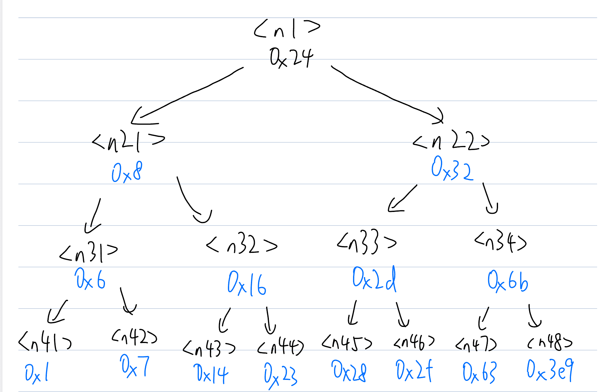
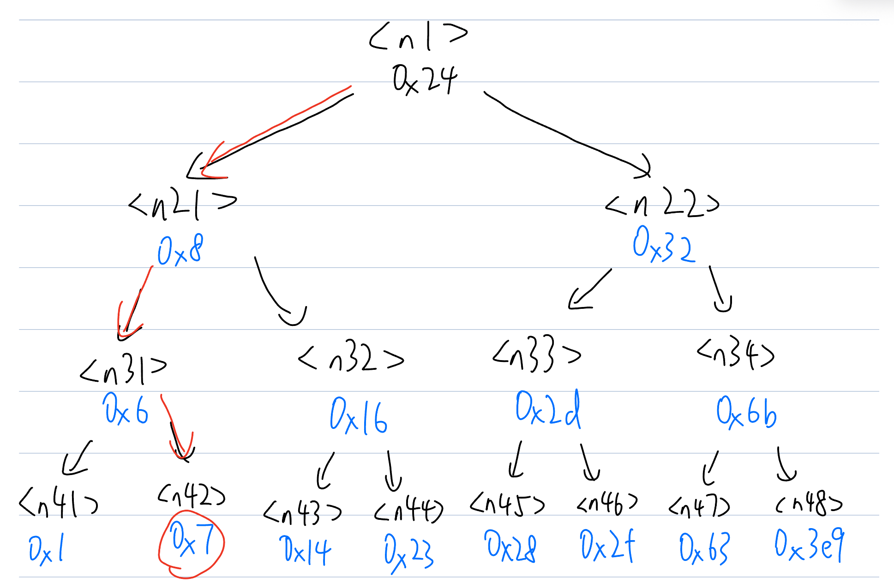

> ⚠️ 注意，本文只提供个人的解法与思路，不能代替自己亲手用调试器做实验。如果你希望更好地锻炼自己的能力，仅仅在你尝试过，并且被卡住时候，观看对应章节的内容。或者，在你独立做完实验，可以与本指南中的内容核对。也欢迎各位对本文中的拼写错误、细节遗漏等方面进行补充！

本文受到了 [更适合北大宝宝体质的 Bomb Lab 踩坑记](https://arthals.ink/blog/bomb-lab) 很大的启发，因此你可能发现一些雷同的内容，这都只是我的拙劣致敬。

## 实验介绍

本实验是 CSAPP 第三章的实验内容，设计了汇编的许多方面，包括整数运算、字符串比较、循环条件分支、递归调用、栈、指针、链表、结构等等。本文读者应当学习过以上内容，进而更好地理解该实验。

Bomblab 的实验背景相当经典，可以在 `bomb.c` 中看到。简单来说，你需要根据二进制程序来拆弹💣。

## 实验准备

实验暴露出来的源码 `bomb.c` 只涵盖了一小部分，没有涉及每个函数具体是如何实现的。不过，我们可以从中看出大概流程——获取输入，然后执行下面的函数：
```c
initialize_bomb();

printf("Welcome to my fiendish little bomb. You have 6 phases with\n");
printf("which to blow yourself up. Have a nice day!\n");

/* Hmm...  Six phases must be more secure than one phase! */
input = read_line();             /* Get input                   */
phase_1(input);                  /* Run the phase               */
phase_defused();                 /* Drat!  They figured it out!
                    * Let me know how they did it. */
printf("Phase 1 defused. How about the next one?\n");

// 更多内容
```

每次都读取一行作为输入，给 `phase_n` ，然后运行 `phase_defused` 函数。

为了调试二进制程序，需要使用 gdb。我已经在之前的文章中，介绍了 [GDB Dashboard]() 以及 [pwndbg]()。为了更好的体验，建议先配置 pwndbg ，但这不是必需的。本文前四个阶段使用 GDB Dashboard，后两个阶段使用 pwndbg。

参考北大Bomblab踩坑记[^1]，该实验用到的常用调试指令如下：

| 指令          | 全称    | 描述                       |
| ----------- | ----- | ------------------------ |
| r           | run   | 开始执行程序，直到下一个断点或程序结束      |
| q           | quit  | 退出 GDB 调试器               |
| ni          | nexti | 执行下一条汇编指令，但不进入函数内部         |
| si          | stepi | 执行当前汇编指令，如果是函数调用则进入函数      |
| b           | break | 在指定位置设置断点                |
| c           | cont  | 从当前位置继续执行程序，直到下一个断点或程序结束 |
| p           | print | 打印变量的值                   |
| x           |       | 打印内存中的值                  |

注意 `n` 或者 `q` 指令是直接进行一步源代码指令，因此该实验中不会用到。`p` 是打印变量的值，通常是寄存器，不过在 pwndbg 的存在下没什么必要。`x` 是打印某个地址对应的值，也可以看做进行一次解引用操作，相当常用。

一些常用指令：
```bash
x/2x $rsp  # 以十六进制格式查看栈指针 %rsp 指向的内存位置 M[%rsp] 开始的两个单位。
x/2d $rsp # 以十进制格式查看栈指针 %rsp 指向的内存位置 M[%rsp] 开始的两个单位。
x/2c $rsp # 以字符格式查看栈指针 %rsp 指向的内存位置 M[%rsp] 开始的两个单位。
x/s $rsp # 把栈指针指向的内存位置 M[%rsp] 当作 C 风格字符串来查看。

x/b $rsp # 检查栈指针指向的内存位置 M[%rsp] 开始的 1 字节。
x/h $rsp # 检查栈指针指向的内存位置 M[%rsp] 开始的 2 字节（半字）。
x/w $rsp # 检查栈指针指向的内存位置 M[%rsp] 开始的 4 字节（字）。
x/g $rsp # 检查栈指针指向的内存位置 M[%rsp] 开始的 8 字节（双字）。
```

注意 `/` 后面的后缀（如 2x、2d、s、g、20c）指定了查看内存的方式和数量。具体来说：
- 第一个数字（如 2、20）指定要查看的单位数量。
- 第二个字母（如 x、d、s、c）指定单位类型和显示格式，其中：
    - c / d / x 分别代表以字符 / 十进制 / 十六进制格式显示内存内容。
    - s 代表以字符串格式显示内存内容。
- 第三个字母（如 b / h / w / g）分别代表以 1 / 2 / 4 / 8 字节为单位（unit）显示内存内容。

为了方便每次运行 `gdb bomb` 都能进入我们想要的部分，可以编辑当前文件夹下的 `.gdbinit` 文件（注意还需要更改系统的`~/.config/gdb/gdbinit`，参考[GDB Dashboard 教程]() ）：

```bash
set args psol.txt

b phase_1
#b phase_2
#b phase_3
#b phase_4
#b phase_5
#b phase_6

#b phase_defused

setupwin /dev/pts/5
```

这当中 `set args` 可以指定参数。当前目录下的 `psol.txt` 文件的每一行，就是对每一个阶段的解答。这样每次完成一个阶段，都可以写入 `psol.txt` 文件，不用重复输入密码。

断点可以根据当前阶段设置。`#` 开头的是注释。例如当前完成了前两个阶段，就可以只为第三阶段开启。

最后一行是我为 pwndbg 自定义的函数，为了打印调试信息到指定内容，参考 [pwndbg 教程与自定义配置]()。

同时，因为 GDB 或者 pwndbg 能看到的反汇编代码的范围有限，为了方便查找，可以一次性生成反汇编代码并存储：
```bash
objdump -d bomb > bomb.asm
```

这样就可以在 VSCode 中查找。

> 如果你发现 CSAPP Labs 只有远程桌面，其实你可以简单地把 gitlab 链接复制，在本地或其他指定的地方克隆下来，运行即可。例如我使用的是一个远程 Ubuntu 电脑，本地使用 VSCode SSH，以及直接利用 [Tabby](https://tabby.sh/) SSH 连接。

> 本文中不区分 eax 与 rax 等 32 位与 64 位寄存器，认为是等价的。本文中十六进制尽量使用 0x 前缀开头，但可能有遗漏。


## phase_1


运行程序 `gdb bomb`，然后输入 `run`：
```
(gdb) run
Starting program: /home/ywr/dsc/learn/csapp/bomblab/bomb psol.txt
Welcome to my fiendish little bomb. You have 6 phases with
which to blow yourself up. Have a nice day!

```

此时可以随意输入一些尝试，例如我输入 `123456` 并回车，就进入了 `phase_1` 的断点：
```bash
Breakpoint 1, 0x0000000000400e6d in phase_1 ()
(gdb) 
```


搜索 `phase_1`，可以看到如下代码：
```asm
0000000000400e6d <phase_1>:
  400e6d:	48 83 ec 08          	sub    $0x8,%rsp
  400e71:	be d0 23 40 00       	mov    $0x4023d0,%esi
  400e76:	e8 cf 04 00 00       	callq  40134a <strings_not_equal>
  400e7b:	85 c0                	test   %eax,%eax
  400e7d:	75 05                	jne    400e84 <phase_1+0x17>
  400e7f:	48 83 c4 08          	add    $0x8,%rsp
  400e83:	c3                   	retq   
  400e84:	e8 be 05 00 00       	callq  401447 <explode_bomb>
  400e89:	eb f4                	jmp    400e7f <phase_1+0x12>

```

可以看到，第三步调用了 `strings_not_equal` 函数。让我们输入两次 `ni`，到达 `0x400e76` 处。
```bash
(gdb) ni
0x0000000000400e71 in phase_1 ()
(gdb) ni
0x0000000000400e76 in phase_1 ()
```

汇编中第一个与第二个参数分别是 %rdi 与%rsi，让我们尝试打印：
```bash
(gdb) p/x $rdi
$1 = 0x603780
(gdb) p/x $rsi
$2 = 0x4023d0
```

我们将这两个看成字符串指针，尝试打印：
```bash
(gdb) x/s $rdi
0x603780 <input_strings>:       "123456"
(gdb) x/s $rsi
0x4023d0:       "Slave, thou hast slain me. Villain, take my purse."
```

可以看出，其中 123456 就是我们输入的字符，也是 `input_strings`。剩下的就应该是第一阶段的密码了。

阅读原先汇编的逻辑，也可以知道在 `strings_not_equal` 调用后，会利用 `test %eax,%eax` 来判断返回值是否为 0（test 指令会对两个操作数进行按位与运算），之后根据 `jne` 进行跳转。如果不为 0，则跳转到 0x400e84，然后调用 explode_bomb 函数，引发爆炸；如果为 0，说明字符串匹配，则恢复栈指针位置，然后返回。

所以第一阶段密码为 `Slave, thou hast slain me. Villain, take my purse.` 。


## phase_2
### read_six_numbers 分析
调用 `read_six_numbers` 后爆炸，对该函数打断点。

rcx 写为 0x00007fffffffdb44，rax 写为 0x00007fffffffdb54，推入栈，然后写为 0x00007fffffffdb50，再推入栈。r9 为0x00007fffffffdb4c，r8 为0x00007fffffffdb48 。

调用前，rdi 为 0x00007fffffffd4d0，rsi 为 0x00000000004025c3。

打印 sscanf 输入参数对应位置：
```
>>> x/s $rdi
0x6037d0 <input_strings+80>:    "123456"
>>> x/s $rsi
0x4025c3:       "%d %d %d %d %d %d"
```
发现其中第一个参数就是我们输入的字符串，第二个就是指定的格式。参考 sscanf 的使用方法[^2]：

```c
int sscanf ( const char * s, const char * format, ...);
```
函数返回值代表捕捉到的参数个数。第一个参数是输入字符串（如 123456），第二个是指定格式（如 `%d %d %d %d %d %d`），之后的参数都是指针，指向希望存储数据的位置。

根据定义，第三个参数开始分别是 rdx、rcx、r8、r9，超过六个参数都会压入调用者的栈中。注意，栈顶是从内存大区域往小区域的，并且压入的参数是逆序的，也就是先压入第8个参数，再压入第7个参数。所以地址最大的 %rsi+0x14 是最先压入的，也就是最后的参数。

调用后，返回值 eax 会与 5 比较，如果小于等于 5，则会直接爆炸。这说明我们应该符合格式，输入 6 个整数进行尝试，如 `1 2 3 4 5 6`。在 0x401486 处停下，打印这些变量，就可以得到此时这些变量。打印的是现在 rsi 指向的地址，也就是0x7fffffffdb40。

```bash
>>> x/6dw 0x7fffffffdb40
0x7fffffffdb40: 0       0       4199486 0
0x7fffffffdb50: -9112   32767
```
目前都为空。经过 sscanf 函数后再次打印：
```bash
>>> x/6dw 0x7fffffffdb40
0x7fffffffdb40: 1       2       3       4
0x7fffffffdb50: 5       6
```
我们发现这就是 sscanf 获得的输入，将我们的输入存到了 6 个 int 类型中，放在栈上，是连续的六个变量。

| 参数    | 值/指向的地址   | 指向的值 |
| ----- | --------- | ---- |
| rdx   | %rsi      | 1    |
| rcx   | %rsi+0x4  | 2    |
| r8    | %rsi+0x8  | 3    |
| r9    | %rsi+0xc  | 4    |
| 第七个参数 | %rsi+0x10 | 5    |
| 第八个参数 | %rsi+0x14 | 6    |

### phase_2 本身分析

之后来分析 phase_2 本身。该部分有详细的汇编注释，但之后的汇编中我会减少相关注释。注意下面的 emoji 代表了跳转的位置：
```asm
0000000000400e8b <phase_2>:
# ...省略...

400ea3:	e8 c1 05 00 00       	callq  401469 <read_six_numbers> # 获取六个数字
400ea8:	83 3c 24 00          	cmpl   $0x0,(%rsp) # rsp 第一个数字 与 0 比较
400eac:	78 07                	js     400eb5 <phase_2+0x2a> # 有符号比较，当第一个数字为负数的时候跳转到爆炸
400eae:	bb 01 00 00 00       	mov    $0x1,%ebx # 将 ebx 变为1
400eb3:	eb 11                	jmp    400ec6 <phase_2+0x3b> # 无条件跳转到 ec6 一行😭
400eb5:	e8 8d 05 00 00       	callq  401447 <explode_bomb> # 爆炸
400eba:	eb f2                	jmp    400eae <phase_2+0x23>
400ebc:	48 83 c3 01          	add    $0x1,%rbx # 😁：rbx += 1
400ec0:	48 83 fb 06          	cmp    $0x6,%rbx # 将 rbx 与 6 比较
400ec4:	74 12                	je     400ed8 <phase_2+0x4d> # 如果相等，说明循环结束，跳转到🚩
400ec6:	89 d8                	mov    %ebx,%eax  # 😭：eax 变成 ebx
400ec8:	03 44 9c fc          	add    -0x4(%rsp,%rbx,4),%eax # eax += rsp对应数组中rbx偏移量后减去4，也就是rbx为1 2 3分别对应数组索引 0 1 2，也即 rsp[rbx-1]
400ecc:	39 04 9c             	cmp    %eax,(%rsp,%rbx,4) # 将 rsp[rbx] 与 eax 比较
400ecf:	74 eb                	je     400ebc <phase_2+0x31> # 如果相等，跳转到😁
400ed1:	e8 71 05 00 00       	callq  401447 <explode_bomb>
400ed6:	eb e4                	jmp    400ebc <phase_2+0x31>
400ed8:	48 8b 44 24 18       	mov    0x18(%rsp),%rax # 🚩：此时循环结束，将 rax 变成 rsp 地址加上 18
400edd:	64 48 33 04 25 28 00 	xor    %fs:0x28,%rax # 异或比较
400ee4:	00 00 
400ee6:	75 06                	jne    400eee <phase_2+0x63> # 如果不相等，跳转到最后一行
400ee8:	48 83 c4 20          	add    $0x20,%rsp # rsp 增加 20
400eec:	5b                   	pop    %rbx # 推出元素
400eed:	c3                   	retq   @ 返回
400eee:	e8 0d fc ff ff       	callq  400b00 <__stack_chk_fail@plt> # 报错
```

可以跟着编译器，看出其跳转的逻辑，写成 C 的话类似这样：
```c
int[] rsp;
int eax;

if (rsp[0] < 0 ) {
    explode();
}

int ebx = 1;

do {
    eax = ebx;
    eax += rsp[ebx-1];

    if (!(eax = rsp[ebx])) {
        explode();
    }

    ebx++;
} while (ebx != 6)
```

所以，第一个循环 eax 为 1，并且 eax 加上数组第 0 个元素，判断是否等于数组第 1 个元素；之后继续循环。

可以有多种解，就是一个二阶等差数列（二次函数），相邻两个元素的差是 `1 2 3 4 5`。同时保证第一个数不小于 0 即可：
```
0 1 3 6 10 15
1 2 4 7 11 16
2 3 5 8 12 17
...
```


## phase_3

在 sscanf 调用前，esi 便是第二个输入参数，代表了匹配的格式，打印得出：

```c
>>> x/s $rsi
0x4025cf:       "%d %d"
```

这说明第三阶段希望匹配两个整数。前面将函数第三个参数 rdx 设置为 rsp 地址，第四个参数 rcx 设置为 `0x4(%rsp)` ，说明 rsp 指向了我们输入的两个数。

```asm
0000000000400ef3 <phase_3>:
400f0f:	be cf 25 40 00       	mov    $0x4025cf,%esi
400f14:	e8 87 fc ff ff       	callq  400ba0 <__isoc99_sscanf@plt>
400f19:	83 f8 01             	cmp    $0x1,%eax  # 比较 sscanf 返回值与 1
400f1c:	7e 10                	jle    400f2e <phase_3+0x3b> # 如果小于等于1，则爆炸
400f1e:	83 3c 24 07          	cmpl   $0x7,(%rsp) # 比较 rsp 指向的值与 7
400f22:	77 42                	ja     400f66 <phase_3+0x73> # 如果大于7，爆炸
400f24:	8b 04 24             	mov    (%rsp),%eax # 否则将 rsp 指向的值放入 eax
400f27:	ff 24 c5 40 24 40 00 	jmpq   *0x402440(,%rax,8) # 将 rax 作为索引，跳转到指定位置
...
```

尝试输入 `1 2`。调试发现 0x400f1e 步 rsp 指向的值为 1，也就是我们输入的第一个数。接下来与 7 进行比较，然后有一大堆跳转。不难想到，这是 switch 的跳转表。可知表的位置在 0x402440 ，尝试打印（打印 8 个单位，以十六进制，每个单位有 8 个字节）。

```
>>> x/8xg 0x402440
0x402440:       0x0000000000400f72      0x0000000000400f35
0x402450:       0x0000000000400f3c      0x0000000000400f43
0x402460:       0x0000000000400f4a      0x0000000000400f51
0x402470:       0x0000000000400f58      0x0000000000400f5f
```

这就是输入数从 0 到 7 的时候，对应的跳转位置。让我们根据下面的代码进行分析，加上注释，将第一个输入称为 x：

```asm
400f1e:	83 3c 24 07          	cmpl   $0x7,(%rsp)
400f22:	77 42                	ja     400f66 <phase_3+0x73>
400f24:	8b 04 24             	mov    (%rsp),%eax
400f27:	ff 24 c5 40 24 40 00 	jmpq   *0x402440(,%rax,8)
400f2e:	e8 14 05 00 00       	callq  401447 <explode_bomb>
400f33:	eb e9                	jmp    400f1e <phase_3+0x2b> # 调到rsp的值与7的比较
400f35:	b8 35 02 00 00       	mov    $0x235,%eax   		# x = 1
400f3a:	eb 3b                	jmp    400f77 <phase_3+0x84>
400f3c:	b8 a7 01 00 00       	mov    $0x1a7,%eax   		# x = 2
400f41:	eb 34                	jmp    400f77 <phase_3+0x84>
400f43:	b8 2b 02 00 00       	mov    $0x22b,%eax   		# x = 3
400f48:	eb 2d                	jmp    400f77 <phase_3+0x84>
400f4a:	b8 6c 00 00 00       	mov    $0x6c,%eax   		# x = 4
400f4f:	eb 26                	jmp    400f77 <phase_3+0x84>
400f51:	b8 f1 02 00 00       	mov    $0x2f1,%eax   		# x = 5
400f56:	eb 1f                	jmp    400f77 <phase_3+0x84>
400f58:	b8 3e 00 00 00       	mov    $0x3e,%eax    		# x = 6
400f5d:	eb 18                	jmp    400f77 <phase_3+0x84>
400f5f:	b8 48 02 00 00       	mov    $0x248,%eax   		# x = 7
400f64:	eb 11                	jmp    400f77 <phase_3+0x84> 
400f66:	e8 dc 04 00 00       	callq  401447 <explode_bomb>
400f6b:	b8 00 00 00 00       	mov    $0x0,%eax
400f70:	eb 05                	jmp    400f77 <phase_3+0x84>
400f72:	b8 21 01 00 00       	mov    $0x121,%eax  		 # x = 0
400f77:	39 44 24 04          	cmp    %eax,0x4(%rsp) 		 # 继续运行，比较eax 与第二个输入数字的值
400f7b:	74 05                	je     400f82 <phase_3+0x8f>  # 如果相等，跳转到下方
400f7d:	e8 c5 04 00 00       	callq  401447 <explode_bomb>  # 不然爆炸
400f82:	48 8b 44 24 08       	mov    0x8(%rsp),%rax  # 开始各种栈相关的操作
400f87:	64 48 33 04 25 28 00 	xor    %fs:0x28,%rax
400f8e:	00 00 
400f90:	75 05                	jne    400f97 <phase_3+0xa4>
400f92:	48 83 c4 18          	add    $0x18,%rsp
400f96:	c3                   	retq   
400f97:	e8 64 fb ff ff       	callq  400b00 <__stack_chk_fail@plt>
```

通过注释，我们不难发现，当 x 从 0 遍历到 7 的时候，都会通过一行 mov 命令设置 eax 的值，然后跳转到 0x400f77，将 eax 与第二个输入进行比较。如果不相等，就爆炸。

因此可以得出多种解法，只要让第二个参数，与对应的 mov 中的硬编码的值一样即可。注意之前 sscanf 的 %d 只能匹配十进制输入，所以需要将十六进制进行转换。

原先十六进制：
```
0 0x121
1 0x235
2 0x1a7
3 0x22b
4 0x6c
5 0x2f1
6 0x3e
7 0x248
```

转换为十进制：
```
0 289
1 565
2 423
3 555
4 108
5 753
6 62
7 584
```

任意一行都是有效的解。

## phase_4
### phase_4 本身分析

照样有 sscanf 函数，打印出 rsi，发现还是两个整数：
```
>>> x/s $rsi
0x4025cf:       "%d %d"
```

第三个参数 rdx 设置为 rsp 地址，第四个参数 rcx 设置为 0x4 (%rsp) ，与第三阶段一样，还是将两个输入存放在 rsp 指向的位置。

调用 sscanf 后先检验返回值是否为 2，如果不是，直接爆炸。接着比较 rsp 指向的值，也就是第一个输入与 0xe（14） 的关系，如果小于等于 14，正常跳转；否则爆炸。
```asm
400ff7:	be cf 25 40 00       	mov    $0x4025cf,%esi
400ffc:	e8 9f fb ff ff       	callq  400ba0 <__isoc99_sscanf@plt>
401001:	83 f8 02             	cmp    $0x2,%eax # 检验返回值是否为2
401004:	75 06                	jne    40100c <phase_4+0x31>
401006:	83 3c 24 0e          	cmpl   $0xe,(%rsp)
40100a:	76 05                	jbe    401011 <phase_4+0x36> # 如果rsp指向的值小于等于14，跳转
40100c:	e8 36 04 00 00       	callq  401447 <explode_bomb> # 爆炸
```

分析接下来的代码：
```asm
401011:	ba 0e 00 00 00       	mov    $0xe,%edx
401016:	be 00 00 00 00       	mov    $0x0,%esi
40101b:	8b 3c 24             	mov    (%rsp),%edi
40101e:	e8 79 ff ff ff       	callq  400f9c <func4>
401023:	83 f8 03             	cmp    $0x3,%eax
401026:	75 07                	jne    40102f <phase_4+0x54>
401028:	83 7c 24 04 03       	cmpl   $0x3,0x4(%rsp) # 将第二个数字与 3 比较
40102d:	74 05                	je     401034 <phase_4+0x59>
40102f:	e8 13 04 00 00       	callq  401447 <explode_bomb>
401034:	48 8b 44 24 08       	mov    0x8(%rsp),%rax # 正常操作
401039:	64 48 33 04 25 28 00 	xor    %fs:0x28,%rax
401040:	00 00 
401042:	75 05                	jne    401049 <phase_4+0x6e>
401044:	48 83 c4 18          	add    $0x18,%rsp
401048:	c3                   	retq   
401049:	e8 b2 fa ff ff       	callq  400b00 <__stack_chk_fail@plt>
```

设置 edx 为 14，esi 为 0，edi 为第一个数字的值，然后调用 func4 函数。

根据输入参数顺序，可以 func4 第一个参数 rdi 为第一个数字，第二个参数为 rsi 为 0，第三个参数 rdx 为 14 。

调用后将返回值与 3 比较，如果不一样，直接爆炸；否则将第二个输入与 3 比较，如果不相等，直接爆炸。所以这里可以确定第二个输入为 3 。

所以，剩下来就看 func4 是如何处理 eax 的，让 fun4 返回值为 3。

### func4 分析

```asm
0000000000400f9c <func4>:
400f9c:	48 83 ec 08          	sub    $0x8,%rsp
400fa0:	89 d0                	mov    %edx,%eax
400fa2:	29 f0                	sub    %esi,%eax
400fa4:	89 c1                	mov    %eax,%ecx
400fa6:	c1 e9 1f             	shr    $0x1f,%ecx
400fa9:	01 c1                	add    %eax,%ecx
400fab:	d1 f9                	sar    %ecx
400fad:	01 f1                	add    %esi,%ecx
400faf:	39 f9                	cmp    %edi,%ecx
400fb1:	7f 0e                	jg     400fc1 <func4+0x25>
400fb3:	b8 00 00 00 00       	mov    $0x0,%eax
400fb8:	39 f9                	cmp    %edi,%ecx
400fba:	7c 11                	jl     400fcd <func4+0x31>
400fbc:	48 83 c4 08          	add    $0x8,%rsp
400fc0:	c3                   	retq   
400fc1:	8d 51 ff             	lea    -0x1(%rcx),%edx
400fc4:	e8 d3 ff ff ff       	callq  400f9c <func4>
400fc9:	01 c0                	add    %eax,%eax
400fcb:	eb ef                	jmp    400fbc <func4+0x20>
400fcd:	8d 71 01             	lea    0x1(%rcx),%esi
400fd0:	e8 c7 ff ff ff       	callq  400f9c <func4>
400fd5:	8d 44 00 01          	lea    0x1(%rax,%rax,1),%eax
400fd9:	eb e1                	jmp    400fbc <func4+0x20>
```

首先将栈指针 rsp 减小，edx（14）放入 eax，减去 esi（0），再放到 ecx，向右移位 0x1f，也就是 31 位，ecx 变成 0 。ecx 加上 eax 变成 14。单独的 sar 就是向右算数移位 1 位，ecx 变成 7。加上 esi 不变。将 ecx（7）与 edi（第一个输入）比较，如果大于，跳转。

- 第一个输入小于 7，跳转到400fc1，将 edx 设置为 rcx 减去 1（6），递归调用自身
- 第一个输入大于等于 7，没有跳转，eax 变成 0，比较 ecx（7）与 edi，此时一定小于等于
	- 小于时跳转400fcd，将 esi 设置为 rcx+1，即 8，递归调用
	- 输入等于 7，不跳转，将栈指针增大，返回


为了方便看，将所有变量前面的 e 或者 r 隐藏：
```c
func4(int dx = 14, int si = 0, int di = 第一个输入) {
    int ax = dx - si;
    int cx = ax >> 31 + ax;
    cx = cx >> 1;
    cx += si;   // cx = (dx-si的符号位 + dx-si) / 2 + si
    if (cx > di) {
        dx = cx - 1;
        func4(dx, si, di); // 这里的 esi 与 edi 与输入的值一样，edx不同
        ax *= 2;
        return;
    } else {
        ax = 0;
        if (cx < di) {
            si = cx + 1;
            func4 (dx, si, di);
            ax = 2 * ax + 1;
            return;
        } else {
            return;
        }
    }
}
```

我们希望运行这个函数后，ax 的值为 3 。

直接分析很难，尝试倒推。ax 有几个地方会被修改：
- 进入函数，ax 设置为 dx - si
- 当修改后的 cx <= di 时，ax 设置为 0
- 之后如果 cx < di，调用函数后，ax 设置为 2 * ax + 1

也可以发现，函数中 di 仅仅会在判断的时候用到，永远不会被修改。并且判断分为三种可能，也就是 cx 与 di 的大小关系，其中 cx 为 `(dx-si -(dx-si) 的符号位 ) / 2 + si`，看起来是取 dx 与 si 的平均值。

例如，一开始输入 dx 为 14，si 为 0，则 cx 为 7。ax 在函数开始初始化为两端之差。

- 若均值大于 di，则 dx 变成 cx-1，也就是大端变成`均值-1`；然后递归调用，其中会改变 ax，最后返回 ax * 2
- 若均值小于 di，则 si 变成 cx+1，也就是小端变成`均值+1`；然后递归调用，其中会改变 ax，最后返回 ax * 2 + 1
- 如果均值等于 di，则直接返回，ax 为 0

这种形式很像二分法。我们希望最后的 ax 返回值为 3，是奇数，其倒推的过程应该是 `0 -> (0 * 2 + 1 = 1) -> (1 * 2 + 1 = 3)` 因此均值应该小于 di，也就是 di 大于 7 。

调用函数过程中，ax 应该为 1 。在这个函数中，1 为奇数，因此其均值也应该小于 di，第二层递归。在第二层递归中，应该均值等于 di，直接返回 ax 为 0 。这样就可以构造出结果。

[0, 14] 的均值为 7，di 大于 7 。[8, 14] 的均值为 11，di 应该大于 11。[12, 14] 的均值为 13。所以应该为 13。

总之，第四阶段输入为：
```
13 3
```

## phase_5

开始时的 sscanf 前面还是 0x4025cf，调试发现还是将输入的两个数字，存到 rsp 所指的栈上，若输入个数小于 2 则爆炸。

```asm
40106a:	be cf 25 40 00       	mov    $0x4025cf,%esi
40106f:	e8 2c fb ff ff       	callq  400ba0 <__isoc99_sscanf@plt> 
401074:	83 f8 01             	cmp    $0x1,%eax
401077:	7e 57                	jle    4010d0 <phase_5+0x82> #输入个数小于2，爆炸
401079:	8b 04 24             	mov    (%rsp),%eax # eax变成第一个输入
40107c:	83 e0 0f             	and    $0xf,%eax
40107f:	89 04 24             	mov    %eax,(%rsp)
401082:	83 f8 0f             	cmp    $0xf,%eax
401085:	74 2f                	je     4010b6 <phase_5+0x68> #爆炸
401087:	b9 00 00 00 00       	mov    $0x0,%ecx
40108c:	ba 00 00 00 00       	mov    $0x0,%edx
401091:	83 c2 01             	add    $0x1,%edx
401094:	48 98                	cltq   
```

接着 eax 变成第一个输入，与 0xf 按位与运算，写入 rsp 第一个输入。如果 eax 等于 0xf，爆炸。然后 ecx 为 0，edx 为 1，并将 eax 拓展为 64 位。

```asm
401091:	83 c2 01             	add    $0x1,%edx # 😎
401094:	48 98                	cltq   
401096:	8b 04 85 80 24 40 00 	mov    0x402480(,%rax,4),%eax
40109d:	01 c1                	add    %eax,%ecx
40109f:	83 f8 0f             	cmp    $0xf,%eax
4010a2:	75 ed                	jne    401091 <phase_5+0x43> # 跳转到 😎，循环计数
4010a4:	c7 04 24 0f 00 00 00 	movl   $0xf,(%rsp)
4010ab:	83 fa 03             	cmp    $0x3,%edx
4010ae:	75 06                	jne    4010b6 <phase_5+0x68>
4010b0:	39 4c 24 04          	cmp    %ecx,0x4(%rsp)
4010b4:	74 05                	je     4010bb <phase_5+0x6d>
4010b6:	e8 8c 03 00 00       	callq  401447 <explode_bomb>
4010bb:	48 8b 44 24 08       	mov    0x8(%rsp),%rax
4010c0:	64 48 33 04 25 28 00 	xor    %fs:0x28,%rax
4010c7:	00 00 
4010c9:	75 0c                	jne    4010d7 <phase_5+0x89>
4010cb:	48 83 c4 18          	add    $0x18,%rsp
4010cf:	c3                   	retq   
4010d0:	e8 72 03 00 00       	callq  401447 <explode_bomb>
4010d5:	eb a2                	jmp    401079 <phase_5+0x2b>
4010d7:	e8 24 fa ff ff       	callq  400b00 <__stack_chk_fail@plt>
```

接下来会取 0x402480 开始的第 rax 的元素，尝试打印：
```c
pwndbg> x/20dw 0x402480
0x402480 <array.3415>:  10      2       14      7
0x402490 <array.3415+16>:       8       12      15     11
0x4024a0 <array.3415+32>:       0       4       1      13
0x4024b0 <array.3415+48>:       3       9       6      5
0x4024c0:       2032168787      1948284271      1802398056      1970239776

```

发现这是一个大小为 16 的数组，这也说明了之前为什么要限制 eax 为 0 到 15 之间的数：
```
10 2 14 7
8 12 15 11
0 4 1 13
3 9 6 5
```

其索引与数组元素的对应关系如下：
| 0   | 1   | 2   | 3   | 4   | 5   | 6   | 7   |
| --- | --- | --- | --- | --- | --- | --- | --- |
| 10  | 2   | 14  | 7   | 8   | 12  | 15  | 11  |

| 8   | 9   | 10  | 11  | 12  | 13  | 14  | 15  |
| --- | --- | --- | --- | --- | --- | --- | --- |
| 0   | 4   | 1   | 13  | 3   | 9   | 6   | 5   |


取其中第 rax 的元素放入 eax，将 ecx 加上 eax。判断 eax 与 0xf（15） 的关系，如果不相等，跳转回 0x401091。期间对 edx 不断加 1，ecx 不断加上 eax。

画出其跳转关系：

`0 -> 10 -> 1 -> 2 -> 14 -> 6 -> 15 -> 5 -> 12 -> 3 -> 7 -> 11 -> 13 -> 9 -> 4 -> 8 -> 0`，然后循环。可以知道当变成 15 的时候终止，所以可以改变终点：

`5 -> 12 -> 3 -> 7 -> 11 -> 13 -> 9 -> 4 -> 8 -> 0 -> 10 -> 1 -> 2 -> 14 -> 6 -> 15 `

循环结束后，将 15 写入 rsp 指向的元素，也就是第一个输入改为 15 。然后将 edx 与 3 进行比较，如果不为 3，跳转并爆炸。

这说明循环需要进行 3 次。例如，我的尝试中输入为 `13 14`，在 0x4010a4 打上断点，发现此时 edx 为 0xa(10)，刚好是上面的链条中 13 到最后 15 的距离。

因此，第一个输入应该是 2，或者 `2 + 16n`，其中 `n` 为自然数。

之后，将 ecx 与第二个输入比较，如果不相等，爆炸。已知 ecx 是累计的数字的和，可知其为 `14 + 6 + 15 = 35`。

总之，输入可以是如下的数：
```
2 35
18 35
34 35
...
```

## phase_6


首先将多个 caller-saved 的寄存器推入栈：
```asm
0000000004010dc <phase_6>:
  4010dc:	41 56                	push   %r14
  4010de:	41 55                	push   %r13
  4010e0:	41 54                	push   %r12
  4010e2:	55                   	push   %rbp
  4010e3:	53                   	push   %rbx
```

接着是金丝雀数的一些操作（参考[^1]），此处略。

然后将 eax 清零，rsp 放入第二个参数 rsi，调用 read_six_numbers。
```asm
4010f6:	31 c0                	xor    %eax,%eax
4010f8:	48 89 e6             	mov    %rsp,%rsi
4010fb:	e8 69 03 00 00       	callq  401469 <read_six_numbers>
401100:	49 89 e4             	mov    %rsp,%r12
401103:	49 89 e5             	mov    %rsp,%r13
401106:	41 be 00 00 00 00    	mov    $0x0,%r14d
40110c:	eb 25                	jmp    401133 <phase_6+0x57>
```
回顾之前的 read_six_numbers 函数，可知第一个参数 dsi 是我们的输入字符串的地址，例如此处我的输入为 `2 3 4 5 6 7`，第二个参数 rsi 是当前 rsp 的地址。

调用 read_six_numbers 后，打印当前 rsp 对应的量：
```
pwndbg> x/6dw $rsp
0x7fffffffd9f0: 2       3       4       5
0x7fffffffda00: 6       7
```

可知我们输入的六个数都存在了栈上。然后函数更改一些寄存器，跳到 0x401133。

```asm
401133:	4c 89 ed             	mov    %r13,%rbp
401136:	41 8b 45 00          	mov    0x0(%r13),%eax
40113a:	83 e8 01             	sub    $0x1,%eax
40113d:	83 f8 05             	cmp    $0x5,%eax
401140:	77 cc                	ja     40110e <phase_6+0x32> # 爆炸
401142:	41 83 c6 01          	add    $0x1,%r14d
401146:	41 83 fe 06          	cmp    $0x6,%r14d
40114a:	74 05                	je     401151 <phase_6+0x75>
40114c:	44 89 f3             	mov    %r14d,%ebx
40114f:	eb cc                	jmp    40111d <phase_6+0x41>
```

将第一个输入放入 eax，与 5 比较，如果大于，爆炸。r14 之前初始化为 0 。现在加上 1，与 6 比较，如果相等，跳到 0x401151 结束循环；否则将 r14 移到 ebx 中，跳到 40111d。

```asm
401115:	83 c3 01             	add    $0x1,%ebx
401118:	83 fb 05             	cmp    $0x5,%ebx
40111b:	7f 12                	jg     40112f <phase_6+0x53>
40111d:	48 63 c3             	movslq %ebx,%rax  # 刚刚跳转的位置
401120:	8b 04 84             	mov    (%rsp,%rax,4),%eax
401123:	39 45 00             	cmp    %eax,0x0(%rbp)
401126:	75 ed                	jne    401115 <phase_6+0x39>
401128:	e8 1a 03 00 00       	callq  401447 <explode_bomb>
```

将 ebx 移入 rax，rsp 中第 rax 个元素放入 eax。第一次来到这里时 ebx 为 1，所以这就是取第二个输入，例如我的是 3。目前 rbp 指向元素就是第一个元素，所以比较第二个元素与第一个是否相等。如果相等，就直接爆炸。否则跳转到 401115，增加 ebx，与 5 比较，如果大于，跳转到 40112f，这会给 rsp 指向的地址加 4，也就是指向下一个元素。

利用调试器，多看几次流程。会发现其本质就是检查输入的 6 个数中第 i 个元素与第 j 个元素是否相等，如果相等就会触发爆炸。然后每次循环后增加 i 索引。同时，也会讲当前第 i 个元素减 1 后与 5 比较，如果大于，也会爆炸。说明当前元素应该小于等于 6 。

因此，我们尝试输入 `1 2 3 4 5 6`，为 0x401151 打断点，跳转。

```asm
401151:	49 8d 4c 24 18       	lea    0x18(%r12),%rcx
401156:	ba 07 00 00 00       	mov    $0x7,%edx
40115b:	89 d0                	mov    %edx,%eax
40115d:	41 2b 04 24          	sub    (%r12),%eax
401161:	41 89 04 24          	mov    %eax,(%r12)
401165:	49 83 c4 04          	add    $0x4,%r12
401169:	4c 39 e1             	cmp    %r12,%rcx
40116c:	75 ed                	jne    40115b <phase_6+0x7f>
40116e:	be 00 00 00 00       	mov    $0x0,%esi
401173:	eb 1a                	jmp    40118f <phase_6+0xb3>
```

首先将输入字符串的指针的地址（在栈上）写入 rcx。edx 与 eax 设为 7，将 `7 - 第一个输入` 写入第一个输入。然后增加 r12 指针指向下一个元素，直到指向尽头（rcx），否则跳转到 0x40115b 重复操作。总之，就是数组每个元素都变成 `7-自身`，因此现在我的数组变成了 `6 5 4 3 2 1`。将 esi 变成 0，跳转到 0x40118f 。

```
40118f:	8b 0c b4             	mov    (%rsp,%rsi,4),%ecx
401192:	b8 01 00 00 00       	mov    $0x1,%eax
401197:	ba d0 32 60 00       	mov    $0x6032d0,%edx
40119c:	83 f9 01             	cmp    $0x1,%ecx
40119f:	7f d4                	jg     401175 <phase_6+0x99>
4011a1:	eb dd                	jmp    401180 <phase_6+0xa4>
```

将 `rsp[rsi]` 放入 ecx，eax 写入 1，edx 是一个地址，然后 `rsp[rsi]` 与 1 比较。如果大于，跳转到 0x401175，否则跳转到 0x401180。尝试打印 edx：
```
pwndbg> x/12xw 0x6032d0
0x6032d0 <node1>:       0x0000027a      0x00000001      0x006032e0       0x00000000
0x6032e0 <node2>:       0x00000353      0x00000002      0x006032f0       0x00000000
0x6032f0 <node3>:       0x00000399      0x00000003      0x00603300       0x00000000
```
可以看到这是一个类似链表的结构—— node1 中 0x006032e0 指向下一个的地址 0x006032e0，以此类推。我们看看一共有多少：
```
pwndbg> x/28xw 0x6032d0
0x6032d0 <node1>:       0x0000027a      0x00000001      0x006032e0       0x00000000
0x6032e0 <node2>:       0x00000353      0x00000002      0x006032f0       0x00000000
0x6032f0 <node3>:       0x00000399      0x00000003      0x00603300       0x00000000
0x603300 <node4>:       0x00000136      0x00000004      0x00603310       0x00000000
0x603310 <node5>:       0x00000249      0x00000005      0x00603320       0x00000000
0x603320 <node6>:       0x0000008a      0x00000006      0x00000000       0x00000000
0x603330 <bomb_id>:     0x000007e6      0x00000000      0x00000000       0x00000000
```
可以看到刚好有 6 个，并且其中数字部分就是 `1 2 3 4 5 6` 。尝试更换我们的输入，我们发现这些链表的值与我们的输入是无关的：

```
Good work!  On to the next...
6 5 4 3 2 1

Breakpoint 1, 0x00000000004010dc in phase_6 ()

pwndbg> c
Continuing.

Breakpoint 2, 0x0000000000401151 in phase_6 ()

pwndbg> c
Continuing.

Breakpoint 3, 0x0000000000401197 in phase_6 ()

pwndbg> x/28xw 0x6032d0
0x6032d0 <node1>:       0x0000027a      0x00000001      0x006032e0       0x00000000
0x6032e0 <node2>:       0x00000353      0x00000002      0x006032f0       0x00000000
0x6032f0 <node3>:       0x00000399      0x00000003      0x00603300       0x00000000
0x603300 <node4>:       0x00000136      0x00000004      0x00603310       0x00000000
0x603310 <node5>:       0x00000249      0x00000005      0x00603320       0x00000000
0x603320 <node6>:       0x0000008a      0x00000006      0x00000000       0x00000000
0x603330 <bomb_id>:     0x000007e6      0x00000000      0x00000000       0x00000000

```

换回 `1 2 3 4 5 6` 的输入。我这里 `rsp[rsi]` 是 5，所以大于，跳转到 0x401175。

```asm
401175:	48 8b 52 08          	mov    0x8(%rdx),%rdx
401179:	83 c0 01             	add    $0x1,%eax
40117c:	39 c8                	cmp    %ecx,%eax
40117e:	75 f5                	jne    401175 <phase_6+0x99>
401180:	48 89 54 f4 20       	mov    %rdx,0x20(%rsp,%rsi,8)
401185:	48 83 c6 01          	add    $0x1,%rsi
401189:	48 83 fe 06          	cmp    $0x6,%rsi
40118d:	74 14                	je     4011a3 <phase_6+0xc7>
```

这一段不断增加 rdx，也就是寻找下一个链表元素，并且计数到 eax 中。记住 ecx 是 `rsp[rsi]` ，所以就相当于是取这个链表的第 `rsp[rsi]` 个元素，rdx 就指向该元素。

然后将链表的第 `rsp[rsi]` 个元素的地址放入栈中。结束循环，现在的栈如下：
```asm
00:0000│ rsp         0x7fffffffd9f0 ◂— 0x500000006
01:0008│-00c         0x7fffffffd9f8 ◂— 0x300000004
02:0010│ r13-4 rbp-4 0x7fffffffda00 ◂— 0x100000002
03:0018│ r12         0x7fffffffda08 —▸ 0x603910 (input_strings+400) ◂— '1 2 3 4 5 6'
04:0020│+00c         0x7fffffffda10 —▸ 0x603320 (node6) ◂— 0x60000008a
05:0028│+014         0x7fffffffda18 —▸ 0x603310 (node5) ◂— 0x500000249
06:0030│+01c         0x7fffffffda20 —▸ 0x603300 (node4) ◂— 0x400000136
07:0038│+024         0x7fffffffda28 —▸ 0x6032f0 (node3) ◂— 0x300000399
08:0040│+02c         0x7fffffffda30 —▸ 0x6032e0 (node2) ◂— 0x200000353
09:0048│+034         0x7fffffffda38 —▸ 0x6032d0 (node1) ◂— 0x10000027a
0a:0050│+03c         0x7fffffffda40 ◂— 0
```

可以看到栈中 00 到 02 存储的是输入数字，已经经过被7减处理了，原本是 `1 2 3 4 5 6`，现在是 `6 5 4 3 2 1`。03 存储的是输入字符串的指针。04 到 09 存储的是链表节点的指针，顺序是根据处理后的输入决定的。

例如，输入 `2 4 5 3 1 6`，处理后变成 `5 3 2 4 5 1`，内存如下：
```
04:0020│+00c         0x7fffffffda10 —▸ 0x603310 (node5) ◂— 0x500000249
05:0028│+014         0x7fffffffda18 —▸ 0x6032f0 (node3) ◂— 0x300000399
06:0030│+01c         0x7fffffffda20 —▸ 0x6032e0 (node2) ◂— 0x200000353
07:0038│+024         0x7fffffffda28 —▸ 0x603300 (node4) ◂— 0x400000136
08:0040│+02c         0x7fffffffda30 —▸ 0x603320 (node6) ◂— 0x60000008a
09:0048│+034         0x7fffffffda38 —▸ 0x6032d0 (node1) ◂— 0x10000027a
```
可以看到这里链表指针的顺序就与我们的输入有关。

接下来又是许多代码：
```asm
4011a3:	48 8b 5c 24 20       	mov    0x20(%rsp),%rbx
4011a8:	48 8b 44 24 28       	mov    0x28(%rsp),%rax
4011ad:	48 89 43 08          	mov    %rax,0x8(%rbx)
4011b1:	48 8b 54 24 30       	mov    0x30(%rsp),%rdx
4011b6:	48 89 50 08          	mov    %rdx,0x8(%rax)
4011ba:	48 8b 44 24 38       	mov    0x38(%rsp),%rax
4011bf:	48 89 42 08          	mov    %rax,0x8(%rdx)
4011c3:	48 8b 54 24 40       	mov    0x40(%rsp),%rdx
4011c8:	48 89 50 08          	mov    %rdx,0x8(%rax)
4011cc:	48 8b 44 24 48       	mov    0x48(%rsp),%rax
4011d1:	48 89 42 08          	mov    %rax,0x8(%rdx)
4011d5:	48 c7 40 08 00 00 00 	movq   $0x0,0x8(%rax)
4011dc:	00 
4011dc:	00 
4011dd:	bd 05 00 00 00       	mov    $0x5,%ebp
4011e2:	eb 09                	jmp    4011ed <phase_6+0x111>
```

还是先将输入变回 `1 2 3 4 5 6`，然后会发现这串代码会改变链表的顺序。原始顺序：

`1 -> 2 -> 3 -> 4 -> 5 -> 6`

在存放顺序是 `6 5 4 3 2 1` 的情况下，这些操作的结果如下（我省略了其他代码的结果）：
```asm
0x4011ad <phase_6+209>    movq   %rax, 8(%rbx)        [node6+8] => 0x603310 (node5) ◂— 0x500000249
0x4011b6 <phase_6+218>    movq   %rdx, 8(%rax)        [node5+8] => 0x603300 (node4) ◂— 0x400000136
0x4011bf <phase_6+227>    movq   %rax, 8(%rdx)        [node4+8] => 0x6032f0 (node3) ◂— 0x300000399
0x4011c8 <phase_6+236>    movq   %rdx, 8(%rax)        [node3+8] => 0x6032e0 (node2) ◂— 0x200000353
0x4011d1 <phase_6+245>    movq   %rax, 8(%rdx)        [node2+8] => 0x6032d0 (node1) ◂— 0x10000027a
0x4011d5 <phase_6+249>    movq   $0, 8(%rax)          [node1+8] => 0
```

再次打印，发现顺序发生变化：
```
pwndbg> x/28xw 0x6032d0
0x6032d0 <node1>:       0x0000027a      0x00000001      0x00000000       0x00000000
0x6032e0 <node2>:       0x00000353      0x00000002      0x006032d0       0x00000000
0x6032f0 <node3>:       0x00000399      0x00000003      0x006032e0       0x00000000
0x603300 <node4>:       0x00000136      0x00000004      0x006032f0       0x00000000
0x603310 <node5>:       0x00000249      0x00000005      0x00603300       0x00000000
0x603320 <node6>:       0x0000008a      0x00000006      0x00603310       0x00000000
0x603330 <bomb_id>:     0x000007e6      0x00000000      0x00000000       0x00000000
```

`6 -> 5 -> 4 -> 3 -> 2 -> 1 -> NaN`

所以，该函数的功能就是根据栈中存放的顺序，重新调整链表节点的顺序。例如输入 `1 2 3 4 5 6`，存放到栈中为 `6 5 4 3 2 1` ，于是链表顺序变成 `6 5 4 3 2 1`。

尝试输入 `5 3 1 2 6 4` ，存放到栈中为 `2 4 6 5 1 3`，链表顺序为 `2 4 6 5 1 3`。

接着跳转到 0x4011ed，将 rbx 指向的下一个节点地址放入 rax，将该下一个节点的值放入 eax，让 rbx 指向的节点的值与该值比较。如果大于等于，跳转；否则爆炸。
```
4011ed:	48 8b 43 08          	mov    0x8(%rbx),%rax
4011f1:	8b 00                	mov    (%rax),%eax
4011f3:	39 03                	cmp    %eax,(%rbx)
4011f5:	7d ed                	jge    4011e4 <phase_6+0x108>
4011f7:	e8 4b 02 00 00       	callq  401447 <explode_bomb>
```

想要跳出循环，需要在上面满足该条件，也就是 ebp 等于 0。而 ebp 一开始为 5，说明会进行遍历操作。
```
4011e4:	48 8b 5b 08          	mov    0x8(%rbx),%rbx
4011e8:	83 ed 01             	sub    $0x1,%ebp
4011eb:	74 11                	je     4011fe <phase_6+0x122>
```

若此处跳转，就可以结束了。所以，我们的目标明确了起来——**找到一组 1-6 的顺序，可以调整链表的连接顺序，进而满足最后的每个节点大于另一个节点的条件**。

观察原始链表中的大小，可以得到正确的排序：

| 链表 id | 值     |
| ----- | ----- |
| 3     | 0x399 |
| 2     | 0x353 |
| 1     | 0x27a |
| 5     | 0x249 |
| 4     | 0x136 |
| 6     | 0x08a |

也就是处理后为 `3 2 1 5 4 6`，处理前为 `4 5 6 2 3 1`。第六阶段密码为 `4 5 6 2 3 1`。

## 结束了？

翻一下汇编，我们会发现一个神秘的函数 `fun7`，它会在 `secret_phase` 中被调用。搜索 `secret_phase`，发现它隐藏在 `phase_defused` 中。

```asm
00000000004015d6 <phase_defused>:
4015d6:	48 83 ec 78          	sub    $0x78,%rsp
4015da:	64 48 8b 04 25 28 00 	mov    %fs:0x28,%rax
4015e1:	00 00 
4015e3:	48 89 44 24 68       	mov    %rax,0x68(%rsp)
4015e8:	31 c0                	xor    %eax,%eax
4015ea:	83 3d 7b 21 20 00 06 	cmpl   $0x6,0x20217b(%rip)        # 60376c <num_input_strings>
4015f1:	74 15                	je     401608 <phase_defused+0x32>
4015f3:	48 8b 44 24 68       	mov    0x68(%rsp),%rax
4015f8:	64 48 33 04 25 28 00 	xor    %fs:0x28,%rax
4015ff:	00 00 
401601:	75 67                	jne    40166a <phase_defused+0x94>
401603:	48 83 c4 78          	add    $0x78,%rsp
401607:	c3                   	retq   
```

发现其中要想进入隐藏阶段，必须满足 `cmpl $0x6,0x20217b(%rip)`，这就是 num_input_strings 的地址。在 read_line 中，每次读取一行的输入，都会将该变量加一。所以这一行代表着结束第六阶段后才能解锁。
```asm
401608:	4c 8d 44 24 10       	lea    0x10(%rsp),%r8
40160d:	48 8d 4c 24 0c       	lea    0xc(%rsp),%rcx
401612:	48 8d 54 24 08       	lea    0x8(%rsp),%rdx
401617:	be 19 26 40 00       	mov    $0x402619,%esi
40161c:	bf 70 38 60 00       	mov    $0x603870,%edi
401621:	e8 7a f5 ff ff       	callq  400ba0 <__isoc99_sscanf@plt>
401626:	83 f8 03             	cmp    $0x3,%eax
401629:	74 0c                	je     401637 <phase_defused+0x61>
```
调试可以发现，该 sscanf 的输入是 `input_strings+240`，也就是第四阶段输入的字符串，例如我的是 `13 3`。匹配的格式是 `%d %d %s`，说明需要额外输入一个字符串。

尝试改变第四阶段输入为 `13 3 hello`，进入 0x401637 ：
```asm
401637:	be 22 26 40 00       	mov    $0x402622,%esi
40163c:	48 8d 7c 24 10       	lea    0x10(%rsp),%rdi
401641:	e8 04 fd ff ff       	callq  40134a <strings_not_equal>
401646:	85 c0                	test   %eax,%eax
401648:	75 e1                	jne    40162b <phase_defused+0x55>
40164a:	bf f8 24 40 00       	mov    $0x4024f8,%edi
40164f:	e8 8c f4 ff ff       	callq  400ae0 <puts@plt>
401654:	bf 20 25 40 00       	mov    $0x402520,%edi
401659:	e8 82 f4 ff ff       	callq  400ae0 <puts@plt>
40165e:	b8 00 00 00 00       	mov    $0x0,%eax
401663:	e8 f7 fb ff ff       	callq  40125f <secret_phase>
```
发现 esi 为字符串 `urxvt`，然后调用字符串匹配。因此我们修改输入为 `13 3 urxvt`，成功进入隐藏阶段。

一开始就要输入，然后调用 strtol 将字符串转换为 long。接着返回值移入 rbx，eax 变成输入的数减一，与 0x3e8 (1000) 比较，如果大于，爆炸。因此我们尝试输入 987。
```asm
00000000040125f <secret_phase>:
40125f:	53                   	push   %rbx
401260:	e8 43 02 00 00       	callq  4014a8 <read_line>
401265:	ba 0a 00 00 00       	mov    $0xa,%edx
40126a:	be 00 00 00 00       	mov    $0x0,%esi
40126f:	48 89 c7             	mov    %rax,%rdi
401272:	e8 09 f9 ff ff       	callq  400b80 <strtol@plt>
401277:	48 89 c3             	mov    %rax,%rbx
40127a:	8d 40 ff             	lea    -0x1(%rax),%eax
40127d:	3d e8 03 00 00       	cmp    $0x3e8,%eax
401282:	77 27                	ja     4012ab <secret_phase+0x4c>
401284:	89 de                	mov    %ebx,%esi
401286:	bf f0 30 60 00       	mov    $0x6030f0,%edi
40128b:	e8 90 ff ff ff       	callq  401220 <fun7>
```

接下来调用函数 `fun7`，第一个参数为 0x6030f0，第二个参数为我们输入的数。可以发现我们希望这个函数的返回值是 4，这就是最终目标。

```asm
0000000000401220 <fun7>:
401220:	48 85 ff             	test   %rdi,%rdi
401223:	74 34                	je     401259 <fun7+0x39>
...
401259:	b8 ff ff ff ff       	mov    $0xffffffff,%eax
40125e:	c3                   	retq   
```
首先判断 rdi 不为 0，否则直接返回 -1 。

然后将 rdi 指向的值放入 edx，这里的值是 0x24，判断与我们输入数的关系。
- 如果输入大于 edx，不跳转，eax 写入 0，跳转到 40124a。将 rdi 后面隔 16 个字节的中数写入 rdi，递归调用
- 如果输入小于等于 edx，跳转，将 rdi 后面隔 8 个字节中的数写入 rdi，递归调用

打印这些值：
```
pwndbg> x/64xg $rdi
0x6030f0 <n1>:  0x0000000000000024      0x0000000000603110 <n21>
0x603100 <n1+16>:       0x0000000000603130 <n22>      0x0000000000000000
0x603110 <n21>: 0x0000000000000008      0x0000000000603190 <n31>
0x603120 <n21+16>:      0x0000000000603150 <n32>      0x0000000000000000
0x603130 <n22>: 0x0000000000000032      0x0000000000603170 <n33>
0x603140 <n22+16>:      0x00000000006031b0 <n34>      0x0000000000000000
0x603150 <n32>: 0x0000000000000016      0x0000000000603270 <n43>
0x603160 <n32+16>:      0x0000000000603230 <n44>      0x0000000000000000 
0x603170 <n33>: 0x000000000000002d      0x00000000006031d0 <n45>
0x603180 <n33+16>:      0x0000000000603290 <n46>      0x0000000000000000
0x603190 <n31>: 0x0000000000000006      0x00000000006031f0 <n41>
0x6031a0 <n31+16>:      0x0000000000603250 <n42>      0x0000000000000000
0x6031b0 <n34>: 0x000000000000006b      0x0000000000603210 <n47>
0x6031c0 <n34+16>:      0x00000000006032b0 <n48>     0x0000000000000000
0x6031d0 <n45>: 0x0000000000000028      0x0000000000000000
0x6031e0 <n45+16>:      0x0000000000000000      0x0000000000000000
0x6031f0 <n41>: 0x0000000000000001      0x0000000000000000
0x603200 <n41+16>:      0x0000000000000000      0x0000000000000000
0x603210 <n47>: 0x0000000000000063      0x0000000000000000
0x603220 <n47+16>:      0x0000000000000000      0x0000000000000000
0x603230 <n44>: 0x0000000000000023      0x0000000000000000
0x603240 <n44+16>:      0x0000000000000000      0x0000000000000000
0x603250 <n42>: 0x0000000000000007      0x0000000000000000
0x603260 <n42+16>:      0x0000000000000000      0x0000000000000000
0x603270 <n43>: 0x0000000000000014      0x0000000000000000
0x603280 <n43+16>:      0x0000000000000000      0x0000000000000000
0x603290 <n46>: 0x000000000000002f      0x0000000000000000
0x6032a0 <n46+16>:      0x0000000000000000      0x0000000000000000
0x6032b0 <n48>: 0x00000000000003e9      0x0000000000000000
0x6032c0 <n48+16>:      0x0000000000000000      0x0000000000000000
0x6032d0 <node1>:       0x000000010000027a      0x0000000000603310
0x6032e0 <node2>:       0x0000000200000353      0x00000000006032d0
```

这些节点的相互引用关系如图：




不断调用，可以发现当 rdi 指向 n48 时，n48 中的值为 3e9 (1001)，必定大于我们的输入。此时结束，跳转到 0x40123d，此时会取 rdi 指向位置的**后 8 个字节**，放入 rdi（**与之前的 16 字节不同！**）。不过现在 n48 对应的这个值为 0 。再次递归调用。这时候因为 rdi 参数为 0，所以将 -1 写入 eax，返回。

- 8 字节情况返回 401246：`eax = eax + eax`，例如我这里变成了-2
- 16 字节情况返回 401253：`eax = rax + rax + 1`，例如我这里有几个状态：
	- `-2 + -2 + 1 = -3`
	- `-3 + -3 + 1 = -5`
	- `-5 + -5 + 1 = -9`
- 最终在 987 输入的情况下，返回为 -9

于是，当时让我迷惑的事情来了：**secret_phase 中希望我们最后得到的返回值是整数 4，这怎么做到呢？**

尝试输入 1 调试，发现当输入的数恰好等于叶子结点时，就会停止递归调用。此时会运行 0x40122f ，将 eax 变成 0 。所以，从反向推导，要得到 4 应该是这样的：

0 -> 2 * 0 + 1 = 1 -> 1 * 2 = 2 -> 2 * 2 = 4

反向过程先是一个大于，然后是两个小于等于。正向过程就是先两个小于等于，然后一个大于。

参考图片：



答案为 7 。


## 总结

这个实验确实量大管饱，我差不多前前后后花了好几天时间才写完。

对于此前没有接触过汇编的我来说，确实有些难度。还好借助了 GDB Dashboard、pwndbg 等强大的调试器，以及部分地方参考了 arthals 的北大 bomblab 博客[^1]。自然有些细节上还是有差异的，并且该博客没有写 secret phase。

经过这样的折腾，确实感觉自己对汇编的掌握更加深入。也让我想起了很久之前手挫 cs61b 的 gitlab 的快感（）

该指南很多地方都是我做 lab 的时候，边想边写的，所以语句可能不通顺，也不是最适合理解的顺序。该指南只记录了我解题中的一些思考过程。如果能在某个卡点帮到你，有所启发，那么我的目的就达成了。


## 参考资料

[^1]: 更适合北大宝宝体质的 Bomb Lab 踩坑记. https://arthals.ink/blog/bomb-lab
[^2]: sscanf. cplusplus. https://cplusplus.com/reference/cstdio/sscanf