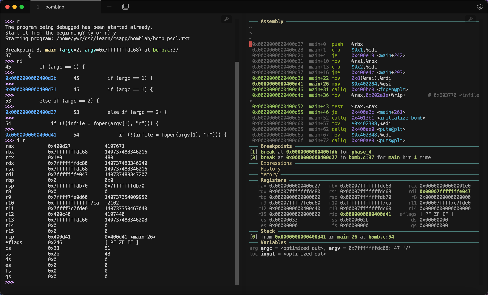
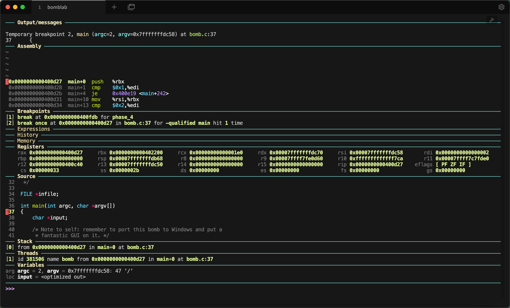
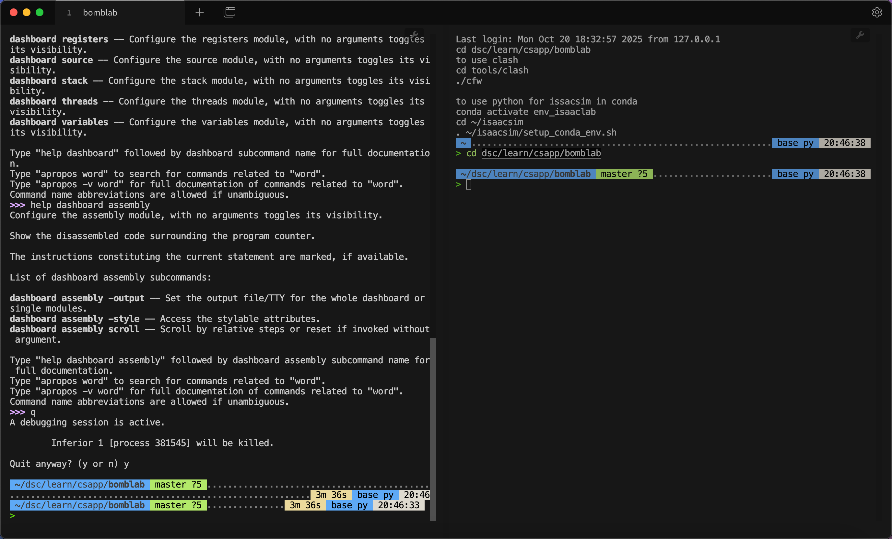
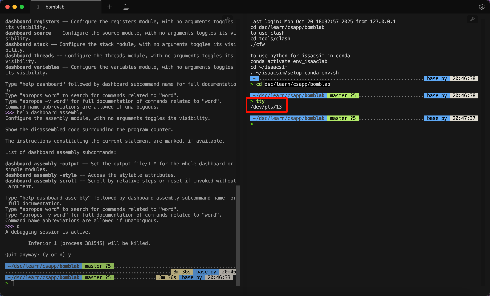
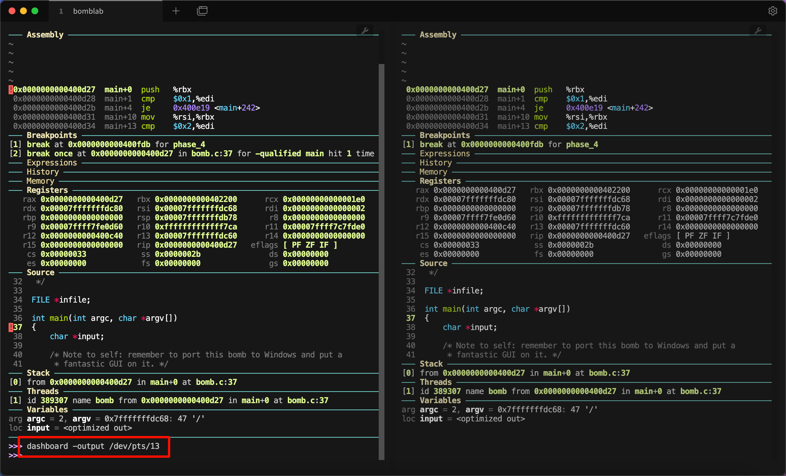
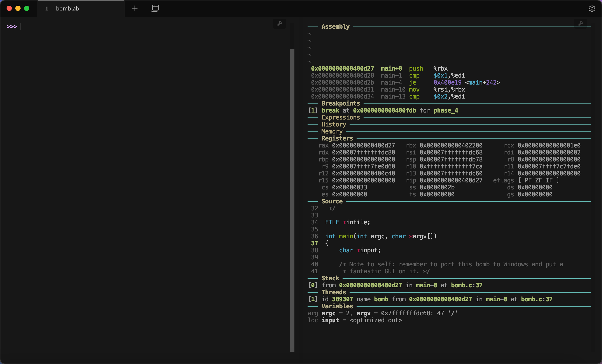

因为要做 CSAPP 的一些实验，所以会接触到汇编级别调试。正如之前介绍 GDB Dashboard 的文章所说[^1]，传统的 gdb -tui 虽然可以同时显示汇编与寄存器，但是版面不够美观，也很难对布局进行自定义。基于 VSCode + GDB 的方法虽然有现代化的UI，但是很难调试汇编程序。而 GDB Dashboard 解决了上述困扰。

GDB Dashboard [^2]基于 Python，重构了 GDB 的页面，且高度支持自定义，相当美观，如图：



我使用了 [Tabby](https://tabby.sh/) 终端，并且配置了左右两个窗口，左侧显示 GDB 指令，右侧显示信息。

## 预备知识
了解 GDB，掌握 Linux 环境与命令行基础。

## 安装方法
GDB dashboard 本质上就是一个脚本，可以很方便地下载：
```bash
wget -P ~ https://github.com/cyrus-and/gdb-dashboard/raw/master/.gdbinit
```
该命令会将`.gdbinit`下载到用户根目录`~`下面。

要想在特定的目录使用 GDB dashboard，只需要将 .gdbinit 复制到对应路径即可。
```bash
mv ~/.gdbinit your_target_dir/
```

然后对 GDB 进行设置，确保载入 `.gdbinit` 。编辑 `~/.config/gdb/gdbinit` 文件，在其中指定加载的地址：

```bash
set auto-load local-gdbinit on
add-auto-load-safe-path /home/ovideros/learn/csapp/bomblab
```

这最后一行中的路径是你需要使用 `.gdbinit` 的工作目录。如果为了省事，也可以设置为全部目录：

```bash
set auto-load local-gdbinit on
set auto-load safe-path /
```

打开下载的 `.gdbinit`，可以看到前几行如下：
```bash
python

# GDB dashboard - Modular visual interface for GDB in Python.
#
# https://github.com/cyrus-and/gdb-dashboard

# License ----------------------------------------------------------------------
# ...
```

如果需要自定义 `.gdbinit` 设置，例如设定调试文件的输入参数，断点位置，都可以在 python 命令前面输入。

现在运行 `gdb ./program`，就可以对 `program` 进行调试。输入 `start`，开启 GDB dashboard。

如果你觉得每次输入 `start` 比较麻烦，也可以写入 `.gdbinit`：
```bash
start

python

# GDB dashboard - Modular visual interface for GDB in Python.
#
# https://github.com/cyrus-and/gdb-dashboard

# License ----------------------------------------------------------------------
# ...
```

这样每次运行 `gdb ./program` 都会默认打开 GDB dashboard 了。

## 自定义配置
### 利用 help
默认的 GDB dashboard 可能不够美观，如图：



主要是其中输入命令的部分过少，且包含一些我们不关心的内容。

好在 GDB dashboard 是高度自定义的。如果不需要一些部分，可以直接输入进行取消。例如，不需要源代码 Source 部分，可以输入 `dashboard source`。

为了获取各种命令，可以输入 `help dashboard`，输出如下：
```bash
>>>  help dashboard
Redisplay the dashboard.

List of dashboard subcommands:

dashboard -configuration -- Dump or save the dashboard configuration.
dashboard -enabled -- Enable or disable the dashboard.
dashboard -layout -- Set or show the dashboard layout.
dashboard -output -- Set the output file/TTY for the whole dashboard or single modules.
dashboard -style -- Access the stylable attributes.
dashboard assembly -- Configure the assembly module, with no arguments toggles its visibility.
dashboard breakpoints -- Configure the breakpoints module, with no arguments toggles its visibility.
dashboard expressions -- Configure the expressions module, with no arguments toggles its visibility.
dashboard history -- Configure the history module, with no arguments toggles its visibility.
dashboard memory -- Configure the memory module, with no arguments toggles its visibility.
dashboard registers -- Configure the registers module, with no arguments toggles its visibility.
dashboard source -- Configure the source module, with no arguments toggles its visibility.
dashboard stack -- Configure the stack module, with no arguments toggles its visibility.
dashboard threads -- Configure the threads module, with no arguments toggles its visibility.
dashboard variables -- Configure the variables module, with no arguments toggles its visibility.

Type "help dashboard" followed by dashboard subcommand name for full documentation.
Type "apropos word" to search for commands related to "word".
Type "apropos -v word" for full documentation of commands related to "word".
Command name abbreviations are allowed if unambiguous.
```

之后需要详细了解哪一部分，也只需要更多地使用 `help`。例如，我想要知道 assembly 部分的详细设置，就可以输入 `help dashboard assembly`：

```bash
>>> help dashboard assembly
Configure the assembly module, with no arguments toggles its visibility.

Show the disassembled code surrounding the program counter.

The instructions constituting the current statement are marked, if available.

List of dashboard assembly subcommands:

dashboard assembly -output -- Set the output file/TTY for the whole dashboard or single modules.
dashboard assembly -style -- Access the stylable attributes.
dashboard assembly scroll -- Scroll by relative steps or reset if invoked without argument.

Type "help dashboard assembly" followed by dashboard assembly subcommand name for full documentation.
Type "apropos word" to search for commands related to "word".
Type "apropos -v word" for full documentation of commands related to "word".
Command name abbreviations are allowed if unambiguous.
```

以此类推。

### 多终端输出
为了解决上面所说的输入部分过少的问题，可以使用多个终端。`dashboard -ouput <terminal>`中，可以手动指定终端来显示信息。

首先创建多个终端，例如这里我使用 Tabby 自带的分割终端功能：



然后在其中一个终端运行tty，得到编号：



然后在另一个终端运行 `dashboard -output /dev/pts/13`，这当中 `/dev/pts/13` 需要修改为你运行 `tty` 获得的具体输出。



这样右边终端就有了我们需要的信息。你可能觉得左边还有这些信息不够美观，很简单，按下 `Ctrl + L` 就可以清空当前内容，只保留接下来的行：



### 我的自定义配置

为了持久化保存配置，参考官方的指南[^3]，可以在多处中任意一处创建配置文件。我这里选择 `~/.config/gdb-dashboard/init` 位置。可以首先进入 `~/.config` 文件夹，创建 `gdb-dashboard` 文件夹，然后在其中创建 `init` 文件如下：

```bash
dashboard -layout assembly breakpoints expressions history memory registers !source stack !threads variables
dashboard assembly -style height 20
dashboard assembly -style highlight-line True
dashboard -output /dev/pts/2
```

其中第一行隐藏了 source 以及 threads，因为目前的实验中用不到。之后第二行到第三行设置了 assembly 的风格。最后一行设置了输出的另一个终端。美中不足是每次新打开双终端使用 GDB Dashboard，都需要根据 `tty` 输出来修改 `.gdbinit`。

## 展望
我也搜到有 pwndbg [^4]之类的调试器，看起来更强大。


## 参考资料
[^1]: 神仙GDB调试工具 gdb-dashboard. 知乎. https://zhuanlan.zhihu.com/p/435918702
[^2]: GDB dashboard. Github. https://github.com/cyrus-and/gdb-dashboard
[^3]: Use personal configuration files. https://github.com/cyrus-and/gdb-dashboard/wiki/Use-personal-configuration-files
[^4]: pwndbg. Github. https://github.com/pwndbg/pwndbg