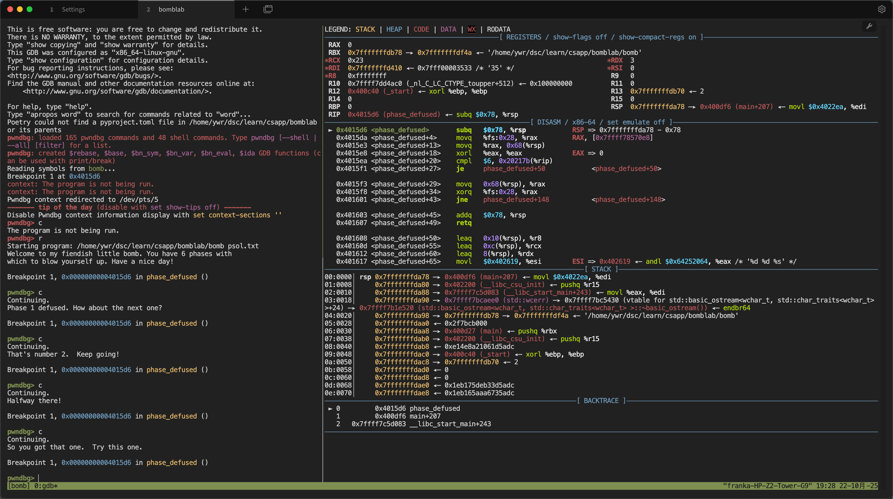
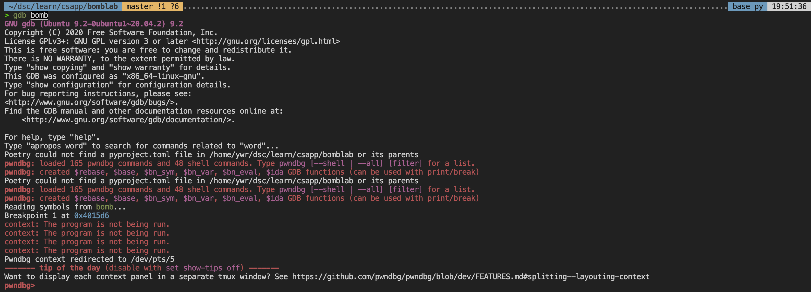
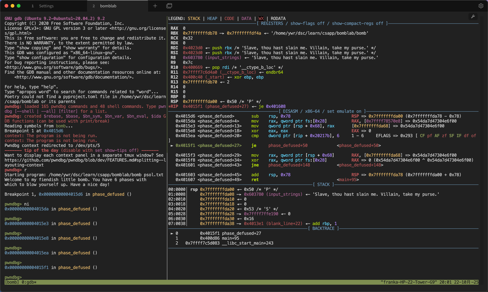

## 前言

之前我写了 [GDB Dashboard 教程]() ，文末提到了 pwndbg，今天详细讲述一下。

pwndbg 是一个支持 GDB[^2] 或者 LLDB[^3] 的插件，便于汇编级别的软件开发者、逆向工程师等[^1]。本文主要探讨其对于 CSAPP Labs 的作用，以及相应的自定义配置。

传统的 GDB 或 LLDB 很难逆向工程，总是要手动输入大量指令，查看内存信息，例如输入 `x/30gx $rsp` 来查看 `rsp` 指向的栈。在当今时代，这并不高效。Pwndbg 是基于 Python 的模组，可以加载进 GDB 或者 LLDB，进而方便查看内存细节。



## 预备知识

了解 GDB，掌握 Linux 环境与命令行基础，了解 Git 使用方法。本文环境都基于 Ubuntu。

## 下载与安装

虽然官方文档提供了许多方法[^4]，但是在我这总遇到一些环境问题，可能因为我使用的是 Ubuntu20.04，版本较老。后面发现克隆 Github 仓库并运行脚本更方便。

首先，克隆官方的 Github 仓库。如果较慢，可以考虑换源、设置代理等，这里不展开。
```bash
git clone https://github.com/pwndbg/pwndbg.git
```

如果你的系统版本较新，可以尝试直接安装：
```bash
cd pwndbg
./setup.sh
```

但是，我会出现下面的报错：
```bash
Your system has unsupported python version. Please use older pwndbg release:
'git checkout 2024.08.29' - python3.8, python3.9
'git checkout 2023.07.17' - python3.6, python3.7
```

原因在于我的系统 python 较老。所以，首先切换到更早的版本，然后再运行安装脚本：
```bash
git checkout 2024.08.29
./setup.sh
```

这样就能正确安装。查看用户目录下的配置文件，即 `~/.gdbinit`，发现它载入了环境，其中 `<path to your github repo>` 取决于你运行 `git clone` 时候的位置：
```bash
source ~/.config/gdb/gdbinit
# source /<path to your github repo>/gdbinit.py
```

为了方便每一次调试都自动启用 pwndbg，可以取消第二行的注释：
```bash
source ~/.config/gdb/gdbinit
source /home/ywr/dsc/learn/csapp/pwndbg/gdbinit.py
```

参考上一篇博客 [GDB Dashboard 教程]() ，这里的 `~/.config/gdb/gdbinit` 应该设置了安全的路径：
```bash
set auto-load local-gdbinit on
add-auto-load-safe-path /<path to your working dir>/
```

或者是全部目录：
```bash
set auto-load local-gdbinit on
set auto-load safe-path /
```

这样，在相应的目录下，直接运行 `gdb <program>`，其中 program 为一个程序，就能进入 pwndbg 页面。
```bash
# 各种信息
pwndbg>
```



## pwndbg+tmux 自定义配置

虽然说 [Tabby](https://tabby.sh/) 也自带分割终端的功能，但是它在分割后会自动降低非当前窗口的亮度，看起来有点奇怪。于是我改用 tmux[^5] 了。

简单来说，Ubuntu 系统下 tmux 可以通过 apt 来安装：
```bash
sudo apt update
sudo apt install tmux
```

然后，创建新的 tmux 会话：
```bash
tmux new -s bomb
```

此处 bomb 可以是任意名字。这样会自动进入当前窗口。要想退出，可以按  `Control + B` 键，松开，再按 `D` 键。

为了再次进入当前会话，输入：
```bash
tmux a -t bomb
```
其中 bomb 是你刚刚取的名字。

分割窗口，按  `Control + B` 键，松开，再按 `%` 键（`Shift + 5`），你会发现窗口分成了左右两块。并且该分割线是可以用鼠标拖动的，至少我在 Tabby 与 VSCode 终端中都可以。

为了将调试信息都放到右边的窗口，我让 AI 帮我写了一段脚本，然后粘贴到 `~/.gdbinit` 文件中：

```bash
# --------------------------------------------------------------------------
# Pwndbg: Custom command to redirect context panes to another TTY
# This Python-based command correctly handles string arguments with special characters.
# Usage: setupwin /dev/pts/X
# --------------------------------------------------------------------------
python
import gdb

class SetupWin(gdb.Command):
    """Redirects Pwndbg context panes to a specified TTY."""
    def __init__(self):
        # Create the command "setupwin" in GDB
        super(SetupWin, self).__init__("setupwin", gdb.COMMAND_USER)

    def invoke(self, argument, from_tty):
        # This method is called when the user types "setupwin"
        if not argument:
            print("Usage: setupwin /dev/pts/X")
            return

        # The argument is passed as a single string, which we can parse safely
        tty_path = argument.strip()
        
        # List of panes you want to redirect (matches your config)
        panes_to_redirect = ['legend', 'code', 'stack', 'regs', 'disasm', 'backtrace']

        # Use gdb.execute to run commands, building the command string in Python
        gdb.execute("context off")
        
        for pane in panes_to_redirect:
            # Safely construct the command string and execute it
            gdb.execute(f"contextoutput {pane} {tty_path} true")
            
        gdb.execute("context on")
        
        print(f"Pwndbg context redirected to {tty_path}")

# Instantiate the class to register the command with GDB
SetupWin()
end


# 这两行加载配置和pwndbg本身，保持不变
source ~/.config/gdb/gdbinit
source /home/ywr/dsc/learn/csapp/pwndbg/gdbinit.py
```

这个脚本利用 Python 定义了 setupwin 函数，输入的参数是另一个要展示的窗口，然后将各个部分都放在另一个窗口上。

用鼠标选择 tmux 中右侧窗口，输入 `tty` 打印信息，得到 `/dev/pts/<num>`，其中 num 数字因人而异。

然后，可以在系统 `~/.gdbinit` 中的末尾，或者当前工作目录的 `.gdbinit` 中，尾部加入这一行：
```bash
setupwin /dev/pts/<num>
```
其中 `<num>` 是刚刚输出的数字。这样每次运行都会自动执行 setupwin 函数。

然后为程序打上断点并运行，就得到了这样的画面：



左侧可以输入命令，右侧有各种调试信息，包括寄存器、反汇编、栈等等。

## pwndbg 调试信息讲解

初次看到 pwndbg 的调试信息可能有点蒙，感觉很多字。这正是因为其中的信息丰富。

### legend
首先，最上方显示的 LEGEND，代表了不同颜色对应的内存区域，解释如下：
- STACK：栈，存储局部变量与函数调用。
- HEAP：堆，动态声明的内存。
- CODE：代码区，储存可执行指令。
- DATA：数据区，存储初始化的数据，如全局变量。
- RODATA：只读代码区。
- RWX：Readable, Writable, and eXecutable. 可以读、写、执行的代码区域。

### registers
该区域存储着寄存器的信息。以上面的pwndbg+tmux分屏配置图片为例，rbx 寄存器信息如下：
```
RBX  0x7fffffffdb78 —▸ 0x7fffffffdf4a ◂— '/home/ywr/dsc/learn/csapp/bomblab/bomb'
```
这当中内存是黄色高亮的，说明是栈区域。rbx 中存放的是 0x7fffffffdb78，这是一个地址，其指向的位置存放的是 0x7fffffffdf4a，这又是一个指针，指向一个字符串，其内容为 `/home/ywr/dsc/learn/csapp/bomblab/bomb`。

不信的话，可以利用 gdb 命令打印出来：
```bash
pwndbg> x/xg 0x7fffffffdb78
0x7fffffffdb78: 0x00007fffffffdf4a
pwndbg> x/s 0x00007fffffffdf4a
0x7fffffffdf4a: "/home/ywr/dsc/learn/csapp/bomblab/bomb"
```

同理，下面的 rdi 与 rsi 存储的都是 0x4023d0 ，是红色，代表是代码区域。打印其中内容：
```
pwndbg> x/s $rdi
0x4023d0:       "Slave, thou hast slain me. Villain, take my purse."
```
发现其指向的是一个字符串。

### disarm
该区域存储着反汇编信息。注意，我这里显示的是 Intel 格式，而不是 AT&T 格式，后者是 CSAPP 的呈现方式。

为了方便，可以设置：
```bash
set disassembly-flavor att
```
将这一行写入 `~/.gdbinit` 的文件末尾。这样就不用每次执行了。

反汇编区域最左侧是指令地址，然后是相对于当前函数的地址，接着是操作符与操作数。

在反汇编区域最右侧，会有该指令的效果，并且默认是开启模拟的，也就是会模拟之后的效果。但是我发现，这有时候会导致之前语句的结果是基于当前指令的，有些麻烦。所以我关掉了：
```
set emulate off
```

你也会发现，对于跳转语句，pwndbg 不同与一般的 GDB，它会在到达这一行后，显示接下来跳转的行，方便你进行观察。

### stack

这里是 rsp 指向的栈区域，在 CSAPP 中也会频繁用到。其中的箭头，也都说明了其值以及引用关系。

以下面的结果为例：
```
00:0000│ rsp 0x7fffffffda00 ◂— 0x50 /* 'P' */
01:0008│     0x7fffffffda08 —▸ 0x6037d0 (input_strings+80) ◂— '1 2 4 7 11 16'
```

记住栈顶拓展是从大到小的。当前 rsp 指向 0x7fffffffda00，其中内容为 0x50，也可以解释为字符 `P` 的 ASCII 码[^6]。

栈的下一个元素的地址为 0x7fffffffda08，其中存放着 0x6037d0，这是输入字符串的指针，字符串为 `1 2 4 7 11 16`。

可以发现，pwndbg 确实相当方便，智能地解析了地址，免去了一遍遍输入指令查看。

### backtrace
该区域记录了调用函数的信息，例如
```
 ► 0         0x4015e8 phase_defused+18
   1         0x400da2 main+123
   2   0x7ffff7c5d083 __libc_start_main+243
```
说明当前处在 phase_defused 函数中，该函数在 main 中调用，而 main 又在__libc_start_main 中被调用。

## 我的自定义配置

为了方便查看更多信息，我还增大了反汇编与栈区域的行数，以及设置了 show-compact-regs 为 on 。

我的具体配置如下：
```bash
# 自定义的 SetupWin 函数，此处略

# 这两行加载配置和pwndbg本身，保持不变
source ~/.config/gdb/gdbinit
source /home/ywr/dsc/learn/csapp/pwndbg/gdbinit.py

set disassembly-flavor att
set show-compact-regs on
set context-disasm-lines 15
set context-stack-lines 15
set emulate off
```
将最后几行写入 `~/.gdbinit` 即可。


## 总结

本文讲述了如何在 Ubuntu 上安装并配置 pwndbg，希望能有所启发。


## 参考资料
[^1]: pwndbg. Github. https://github.com/pwndbg/pwndbg
[^2]: GNU Debugger. Wikipedia. https://en.wikipedia.org/wiki/GNU_Debugger
[^3]: LLDB. https://lldb.llvm.org/
[^4]: Setup. pwndbg documentation. https://pwndbg.re/pwndbg/latest/setup/
[^5]: tmux Wiki. https://github.com/tmux/tmux
[^6]: ascii. Wikipedia. https://en.wikipedia.org/wiki/ASCII