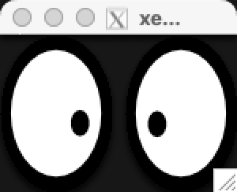
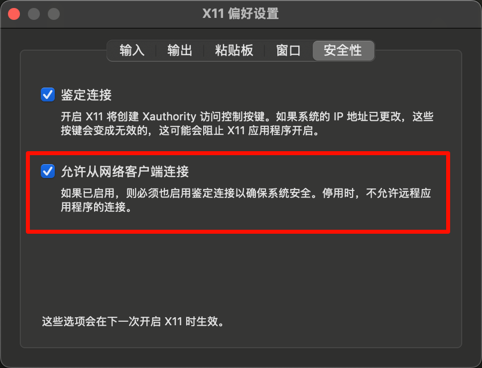

本文探讨了如何使用x11+XQuartz客户端，在Mac上连接远程Ubuntu（或其他Linux）服务器，并弹出应用窗口。

然而，实际上这种效果并不是最优的，例如最简单的`xeyes`或者`glxgears`都不是很流畅。更好的方案包括VNC，或者使用更直接的远程桌面程序（如ToDesk、向日葵等等）。

之前我也尝试过VNC，以及ToDesk等程序。未来有机会可以梳理。

## 预备知识

假设你了解基本的 Linux 环境，以及命令行操作。可以参考 [Missing Semester](https://csdiy.wiki/%e7%bc%96%e7%a8%8b%e5%85%a5%e9%97%a8/MIT-Missing-Semester/) 进行学习。

## Ubuntu服务器端操作

修改 `/etc/ssh/sshd_config` 中关于 SSH 的配置，将
```
#X11Forwarding yes
```
或者
```
X11Forwarding no
```
选项，修改为：
```
X11Forwarding yes
```

可以使用任意编辑器（如 Vim[^1], Nano[^2]）编辑后保存，需要 sudo 权限（`sudo vim /etc/ssh/sshd_config`）。

然后，重启 SSH 服务：
```bash
sudo systemctl restart sshd
```

之后，安装 X11 相关的包（假设使用 Ubuntu，其他发行版可使用其他包管理器）：
```bash
sudo apt update
sudo apt install -y xauth x11-apps
```

## Mac客户端操作

下载 [XQuartz](https://www.xquartz.org/)。吐槽一下，好久没有更新了。

因为我配置了本地的 zsh，使用了带有 UTF-8 的主题，所以 XQuartz 打开后显示乱码。（理论上好像也有配置 XQuartz 使用 UTF-8 的方法，但是懒得做了）

有一些更先进的终端软件，支持 UTF-8 编码，如 [Tabby](https://tabby.sh/)。该终端支持各个平台，也比较现代化与美观，且支持 X11 转发，符合需求。进入 Github 发布页面，下载对应版本即可（m芯片的 Mac 下载 `macos-arm64.dmg` 后缀的包，然后正常安装）。

新建窗口，进入本机的 Shell。然后使用 `ssh -Y user@host` 连接远程服务器，其中 `user@host` 是目标服务器的用户名与ip。更多有关 SSH 登录的细节参考 Missing Semester 的第五讲[^3][^4]。

登录后，运行 `echo $DISPLAY`，输出应该如下：
```
localhost:10.0    
```
也可以是 11.0 等数字。

尝试运行 `xeyes`，应该能在本地 Mac 运行 XQuartz，弹出一个窗口，显示效果如下：

<center></center>


这说明基本的 X11 流程配置完成。

如果配置中遇到问题，建议带着具体报错询问 AI。

## GLX/OpenGL设置

上述实现了基本 X11 功能，但对于依赖 GLX/OpenGL 的包（例如 Pygame 等），则还需要进一步配置。

首先确保Ubuntu服务器端安装相应包：
```bash
sudo apt install libgl1-mesa-glx libgl1-mesa-dri mesa-utils
```

然后在Mac上打开终端，退出XQuartz，运行下面指令，把 XQuartz 的间接 GLX 打开：
```bash
defaults write org.macosforge.xquartz.X11 enable_iglx -bool true
defaults write org.xquartz.X11 enable_iglx -bool true
```

重新启动XQuartz，`⌘+,`打开设置，确保开启允许网络客户端连接，如图：
<center></center>


重新连接服务器（`ssh -Y user@host`），尝试运行 `glxinfo`，确保没有报错。如果有关于swrast的报错
```
libGL error: No matching fbConfigs or visuals found
libGL error: failed to load driver: swrast
```
可以尝试设置环境变量：
```bash
export LIBGL_ALWAYS_INDIRECT=1
```

之后运行glxgears测试：
```bash
glxgears
```
可以看到本地弹出窗口，显示旋转的齿轮。说明配置成功。


## 总结

然而，由于X11本身协议并没有那么好，所以很可能看起来卡顿。为了更流畅的体验，可能还是要使用其他方案。X11本身方便在不创建完整的桌面，只是弹出部分程序的窗口。

如果你有更好的远程桌面相关方案，也欢迎讨论！（如VNC、商业软件等等）


## 参考资料
[^1]: Vim. Wikipedia. https://en.wikipedia.org/wiki/Vim_(text_editor)
[^2]: GNU Nano. Wikipedia. https://en.wikipedia.org/wiki/GNU_nano
[^3]: 命令行环境. Missing Semester 中文版. https://missing-semester-cn.github.io/2020/command-line/
[^4]: [自制双语字幕] 计算机教育缺失的一课(2020) - 第5讲 - 命令行环境
. https://www.bilibili.com/video/BV1Jh4y1Z7SV/
